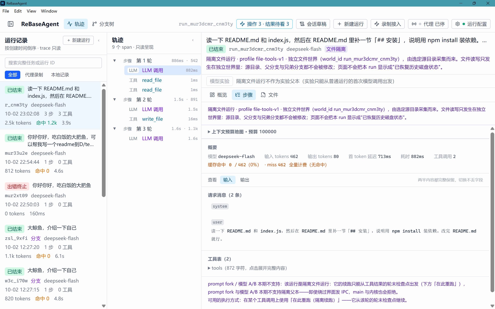
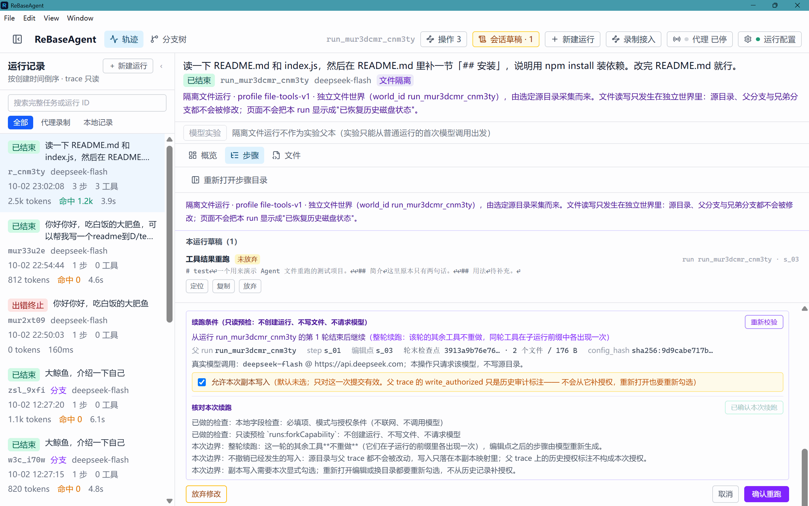
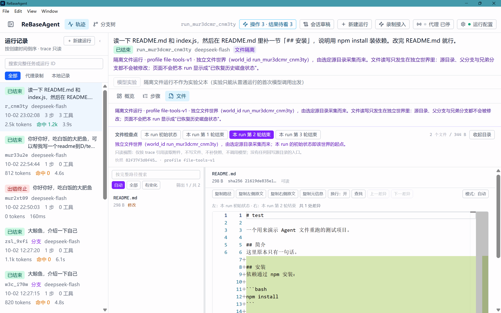
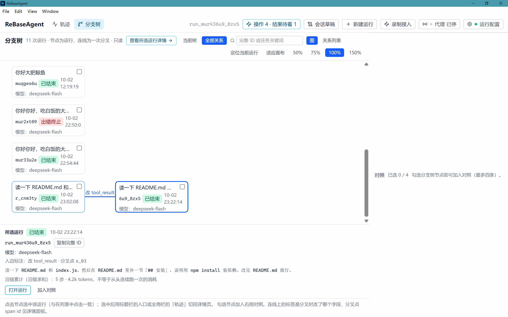

# ReBaseAgent

> **Agent 写错了文件，改掉那一步，让它从那里重新跑。**
> 本地保存轨迹与文件快照；真实模型请求按用户配置发送给服务商。

[](LICENSE)
[](https://github.com/pomelotea-yuzu/ReBaseAgent/releases/tag/v0.4.0-rc.1)



## 这是什么

Agent 调试多轮文件任务时有个具体的困难：**恢复了历史消息，后续工具却读到了当前目录的文件**，导致续跑起点无法解释。已有的调试器大多能看到"它做了什么"，但改不了。

ReBaseAgent 在本项目的执行循环与受控 `read_file` / `write_file` 工具范围内，把工具观察的编辑点对应到**整轮结束的文件快照**，从独立分支继续执行。编辑工具结果只改变模型看到的观察，不撤销该轮写入，也不重新执行被编辑的工具。

| 传统调试 | ReBaseAgent |
|---|---|
| Profiler | 上下文预算地图（token 花在哪了） |
| 改一行代码重跑 | 编辑某步 tool_result，从该步重跑 |
| 回归测试 | Trace-as-Test 轨迹回放 |
| git diff | 两次运行的分叉点定位 |

对比 LangGraph 的检查点分叉、Langfuse / Phoenix 的提示词实验与重试能力，本项目的技术说明集中在**消息与文件状态的对齐、分支隔离和失败拒绝边界**。同类方案与本项目的对照见[方案调研](docs/research/2026-09-27-agent-debugging-landscape.md)与[机制说明](docs/architecture/replay-state-consistency.md)。跨产品的性能与使用效果尚待同任务验证。

## 下载

**Windows x64 便携版（约 95 MB，<100 MB，免安装）** → [GitHub Releases](https://github.com/pomelotea-yuzu/ReBaseAgent/releases/tag/v0.4.0-rc.1) / [Gitee Releases](https://gitee.com/yuzu-tea-duck/re-base-agent/releases/tag/v0.4.0-rc.1)

最新打包为 **0.4.0-rc.1**（发行候选，人工实机验收已通过）：单文件体积 `95,542,495` bytes，SHA-256 前缀 `50a1a9cf7ac61ec3`，低于 Gitee 单附件 100 MB 上限。双击运行，无需安装；应用数据保存在 exe 旁的 `data/` 目录，迁移时同时携带该目录。便携启动器会使用临时解包目录，不能将便携理解为"不产生临时文件"。

> 0.4.0-rc.1 包含隔离文件重跑与全部已归档的桌面工作区能力。**上传 GitHub / Gitee Releases 属独立步骤，完成前上述链接暂不可用**；版本、哈希与发布依据见[项目状态](docs/development/project-status.md)。历史正式版 [v0.2.0](https://github.com/pomelotea-yuzu/ReBaseAgent/releases/tag/v0.2.0) 不代表长期维护承诺，支持范围见 [SECURITY.md](SECURITY.md)。

> 首次运行会有 Windows SmartScreen 的"未知发布者"提示（本项目尚未购买代码签名证书），点「更多信息 → 仍要运行」即可。

## 它能做什么



**改一步，从那一步重跑** — 停在想改的那一步，改掉模型当时看到的工具结果，从该步继续执行。分叉点之前的上下文在本地拼接复用（零 API 调用），只有分支点之后才真调模型；重发的前缀可能命中服务商的前缀缓存。实测（3 次调用的 run 改最后一步）：只发 **1 次**请求、484 输入 tokens **命中 256**，全价口径消耗为父 run 的 **21%~40%**。



**带写工具的 run 也能安全地退回去重跑** — 这是与"只能看"的调试器最实际的差别。从一个目录创建带文件检查点的隔离 run，编辑某一步的工具结果后，从**那一轮的副本文件世界**续跑：父 run、源目录、兄弟分支逐字节不变，同轮兄弟工具的原效果保留且不重放。文件按内容寻址跨 run 共享，整个数据目录搬走后照样可读可分叉。

**改启动上下文，从头重跑** — 改 system prompt 或首条 user message 后完整重跑，独立记录新轨迹，父 run 只作溯源对照；多分支可并排比较新旧行为。启动上下文变了，前缀天然不复用，所以这是新实验而非同源回放。



**比两段行为** — 搜索与定位分支，两条运行可在完整比较工作区核对编辑、输出、步骤和指标，两到四条可看指标表。展示逐臂事实与相对父本的增量，不自动评出胜者。

**留一份可回放的记录** — 已封存 trace 当卡带，用你当前的 agent-loop 与工具声明本地重跑：零 API 消耗的 Agent 运行时回归测试，可进 CI（见 [`packages/trace-test`](packages/trace-test)）。命令行提供 `rebaseagent-trace-test` 与 `rebaseagent-model-ab`。

**看清上下文预算** — token 花在哪了，按消息与工具分布可视化；`llm.call` 记录 `cache_hit` / `cache_miss`，run 列表直接显示"这次调用的前缀省没省"。

**失败原因可诊断** — 模型调用失败时记录脱敏并限长的 `error`（message + 已知时的 HTTP 状态码）：轨迹树标红该节点，详情直接给出原因与状态码，并声明 tokens / 延迟是占位零值；老 trace 缺该字段时显示「错误详情未记录」而不猜造原因。

**调试草稿不丢** — 切步骤、运行、设置或关闭编辑区后，会话内按编辑目标保留原始文本（包括空串和非法 JSON），失败后可返回修改。

**父链缺失时仍能阅读** — 仅在确认祖先文件不存在时，展示已校验的当前运行记录，并明确父链不完整、继承内容未知；损坏或非法版本继续拒绝读取。

<details>
<summary>完整能力清单（源码视角，含边界与限制）</summary>

### 桌面端

- **span 时间线** — 逐步查看每一次迭代、每一次 LLM 调用、每一次工具执行，以及模型当时实际看到的完整上下文
- **Monaco 内联编辑** — 离线自托管，直接查看和编辑任意一步的 `tool_result`
- **原生 run 创建** — 桌面端「新建运行」进入创建工作区，填写任务、核对模型配置即可跑一个 run（空工具表、纯对话），不依赖代理与脚本；产出的根 run 可直接作为 prompt fork / 模型 A/B / trace-test 的父本
- **本地 LLM 录制代理与录制工作区** — 从「录制接入」配置代理，分别核对已启用、实际监听和已捕获 key；只复制已核实的监听地址。把应用的 `base_url` 改成该地址、保留原 key 即可录制；「编辑 messages 重发」进入独立工作区，只重发一个模型请求，不执行外部工具或恢复外部应用的工作目录
- **执行与结果闭环** — 主动操作由主进程统一登记、去重并占用单个执行槽；跨页查看状态，未知时先核对，按可信运行 ID 读取结果或定位失败。后台完成不抢当前页面，关闭面板不代表停止执行
- **模型 A/B 实验** — 同一父 run 起点批量换 model / 采样参数，多臂顺序执行、独立录制。实验工作区先由后端生成 dry-run 计划，再确认费用；编辑臂或保存/清除模型配置会让旧计划失效。结果保留成功、失败、缺臂和不可读事实，可选两到四条进入共用比较

### 包与 CLI

CLI（均含 `--help`，退出码 0=成功 / 1=执行失败 / 2=配置错误）：

```bash
# Trace-as-Test：卡带重跑回归（零网络、零费用，可进 CI）
rebaseagent-trace-test tests/agent.trace.test.jsonl --config agent.config.mjs

# 模型 A/B：先 dry-run 看计划（免密钥、不联网），再真实执行（按实际调用计费，臂数不等于请求数；需 REBASEAGENT_API_KEY）
rebaseagent-model-ab --parent <runId> --dir <tracesDir> \
  --arm "deepseek-chat;temperature=0.2" --arm "deepseek-chat;temperature=1.5" \
  [--dry-run | --confirm-cost]
```

### 时间旅行的实现方式

```text
回到第 N 步 = 查表（读取第 N 个 llm.call 的录制请求，零 API 调用）
编辑        = 修改该步的 tool_result
重跑        = 从第 N 步继续执行（前缀本地拼接复用，零调用；分支点后才真调 API）
             重发的前缀可能命中 provider 前缀缓存（实测：3 次调用 → 1 次，484 输入命中 256）

prompt fork = 编辑首次 llm.call 的启动上下文（system prompt / 首条 user message）
重跑        = 从第 1 步完整执行（启动上下文变了，前缀不复用——这是新实验，不是同源回放）
```

### 三种"重跑"的区别

|                | 普通重跑 / prompt fork | **隔离文件重跑** | Trace-as-Test 卡带   |
| -------------- | ----------------- | ------------------ | ----------------- |
| 文件从哪来          | 宿主磁盘（`exec.cwd`）  | 快照的**副本世界**        | 不涉及文件             |
| 工具怎么执行         | 调用方传入的 handler     | 固定 `file-tools-v1` | 不执行，逐条消费录制结果      |
| 文件状态能回退吗| ❌ 不承诺             | ✅ 回到分叉那一轮的轮末状态     | —                 |
| 会真调 LLM        | 普通续跑从分叉后；prompt fork 从头 | 是（分支点之后）           | 否（零网络、零费用）        |
| 适合             | 纯对话 / 只读工具        | **带写工具的 run**      | 已封存 trace 当回归用例   |

> 隔离重跑只保真**受控普通文件的内容**（逻辑路径 + 原始字节）；文件权限、时间戳、符号链接身份、网络与数据库**不在**保真范围内。

### 当前限制（诚实声明）

- 只构建了 **Windows x64**，macOS / Linux 尚未出包
- **接入仍需手工**：原生运行需在「设置」里配置模型；外部 Agent 可接 SDK，或将 `base_url` 改为录制代理地址。自动发现外部项目尚未提供
- 时间旅行现在支持**改 `tool_result`（从该步重跑，前缀共享）与改启动上下文（system prompt / 首条 user message，从头重跑）**；执行循环中任意中间历史消息编辑尚不支持，代理 messages 工作区只重发单请求
- **草稿与阅读位置只在会话内恢复**：renderer 重载或应用重启后不恢复草稿正文、阅读偏好与执行授权。操作登记可供核对，不代表已实现真正取消、实时步骤推送、任务队列或跨主进程重启的任务恢复
- prompt fork **从头计费**：启动上下文变了前缀天然不复用，不承诺命中父 run 的 prompt cache（是否命中由 provider 自行决定）
- 代理录制的 run 现在会从请求体现算 `config_hash`（有 system + 可解析工具表时），因而**可以作为 prompt fork / 模型 A/B 的父本**；不含字符串 system 消息的录制（无法派生指纹）仍不能，只能走"编辑 messages 重发"
- **文件工作区的 diff 只对"文本且可读"的附件生效**：二进制附件只展示大小与哈希；附件在磁盘上缺失或与清单记录的哈希/长度不符时，界面明确标出「附件缺失 / 附件损坏」并拒绝展示内容（不会用空文本或源目录兜底）；两侧都没有内容时不渲染空编辑器。文件视图全程只读，**没有**"应用 / 回写到源目录"的入口
- **隔离父本上的 prompt fork 与模型 A/B 不支持**：界面显示「本期不支持」并给出原因，绕过界面直接发 IPC 也会在 main / 内核被拒；普通父本不受影响
- 隔离能力**不是权限系统**：副本写入授权只表示"同意把写入落在副本上"，不改变源目录的访问权限，也不提供 shell、任意 handler、外部网络/数据库的隔离
- **普通重跑**复用分叉点之前的消息，分叉点之后新产生的工具调用会按配置真实执行，可能产生外部副作用，不保证外部状态回退。需要历史文件状态的场景用**隔离文件重跑**；它只保真**受控普通文件的内容**，不承诺恢复 RAG、记忆、数据库或任意 API 的状态
- 命令行模型 A/B 首期只接受**空工具表**的父 run（纯对话任务）；带工具的实验请用桌面端
- **失败原因只覆盖端上模型的调用**：代理录制的 run 在其上游返回非 2xx 时不写 `llm.call`，这类失败没有调用级详情（界面会显示「错误详情未记录」）；脱敏是**尽力而为**——只覆盖本次配置的 apiKey / baseURL 凭据与 Authorization、Bearer、URL 凭据形态，不承诺识别任意业务文本里的所有秘密
- **窄窗口下的外壳表现**：工作区三栏宽度可调（导航 220–360px、文件目录 200–320px、详情列最小 480px；自动折叠不会覆盖手动调过的宽度偏好），视口 ≤800px 进入窄档（目录收起、diff 强制 inline）；隔离创建界面与续跑确认区在窄窗口可滚动、可换行、长路径会折行（已实测），但更窄视口的深度响应式外壳仍在迭代

</details>

## 快速开始

三条路，按你手上有什么选一条：

| 你想做的事 | 走哪条 |
|---|---|
| 先看看它能干什么 | [跑一个纯对话 run](#跑一个纯对话-run) |
| 调试一个会改文件的 Agent | [隔离文件运行](#用带写工具的-run隔离文件运行) |
| 调试你自己已有的 Agent | [SDK 埋点](#只想调试现成的-agent) |

### 跑一个纯对话 run

点全局栏或「运行记录」标题栏的 **新建运行**，在创建工作区填写任务、核对模型配置；如需修改 system prompt，展开高级配置。即可跑一个 run（空工具表、纯对话）。

- 不需要配代理、不需要写代码、不需要外部应用配合
- 产出的 run 是根 run（`parent` / `fork` 为 `null`）且带 `config_hash`，可直接在其上做 **prompt fork / 模型 A/B / trace-test**
- 未在「设置」里配好 baseURL / apiKey / model 时会被拦下，不发起任何请求
- 模型调用失败时同样会落盘一个可查看的 run（列表徽标显示「出错终止」），不静默失败

想跑一个**会改文件**的 Agent 并让它"退回去重跑"，见下一节。

### 用带写工具的 run：隔离文件运行

在「新建运行」创建界面把模式切到 **隔离文件运行**，就能让一个会**改文件**的 Agent 也"退回去重跑"：

1. **选源目录** — 走系统原生目录选择框。采集范围是**该目录下全部受支持的普通文件（含隐藏文件）**；链接、非普通文件、磁盘根，以及数据目录内部的路径会被直接拒绝。首期上限固定、不可配置：**2000 个文件 / 单文件 8 MiB / 快照合计 64 MiB / 一次运行新增内容 128 MiB / 路径 512 字符、32 段**。
2. **源目录不会被修改** — 文件内容只落入数据目录里的**不可变附件**（按内容寻址、跨 run 共享），后续分叉的写入也只落在各自的副本映射里。想验证就跑完对比一下源目录。
3. **知道谁会被送进模型** — 隔离模式固定用 `read_file` / `write_file` 工具组，**这两个工具读出的文本会进入你配置的模型请求**（创建界面会显示当前的 `model` 与 `baseURL`），按实际用量计费。不想被读的文件就别放进源目录。
4. **副本写入每次单独确认** — 「允许本次执行的副本写入」复选框**默认未选**，且**只对这一次提交有效**：重新进入创建界面、切换模式、或重选一次目录，都会让授权作废。选目录 ≠ 授权；父 run 上的历史授权也**不能**替代本次确认（main 侧会独立再校验一遍）。
5. **续跑是两段式** — 在隔离 run 的某个工具调用上点「在此重跑（隔离续跑）」：先**校验续跑条件**（只读预检，不写文件、不请求模型），确认区给出**直接父 run、本地第几轮、轮末检查点**（快照指纹前 12 位 + 文件数/字节）与真实要调用的模型；确认无误后再勾选本次副本写入并提交。续跑按**整轮**边界——编辑点那一轮的其他工具结果作为共享前缀各出现一次、**不重做**。
6. **查看每轮文件状态** — 在「文件」页于「初始状态 / 第 N 轮结束」之间切换检查点，选择文件查看**相对初始快照的文本 diff**；支持路径搜索、变化筛选及阅读位置恢复。整个视图只读，不写文件、不补快照、不调用模型，也不回写源目录；二进制、附件缺失或损坏分别说明，不能渲染成"空文件"。

> 「本地第几轮」取该 run 自己录制的轮号：从"根 run A 的 3 轮"之后从子 run B 再分叉，显示的是「运行 B 的第 1 轮」，不会沿链累加成「第 4 轮」。

### 只想调试现成的 Agent

用 SDK 在你的 loop 里埋点，把 trace 写进桌面应用的数据目录（便携版默认在 exe 旁的 `data/traces/`）：

```ts
import { JsonlTracer } from "@rebaseagent/trace-sdk";

const tracer = new JsonlTracer("traces/r_01.jsonl");
tracer.startRun({
  id: "r_01", format_version: 1, task: "读 README 写摘要",
  model: "deepseek-chat", created_at: new Date().toISOString(),
  parent: null, fork: null, config_hash: "sha256:...",
});

const step = tracer.startSpan({ kind: "agent.step", n: 1 });
const llm = tracer.startSpan({ kind: "llm.call", parent: step, request });
tracer.endSpan(llm, { response });
tracer.endSpan(step);

tracer.endRun({ event: "stopped", reason: "completed", at: 1 });
```

格式细节见 [`packages/trace-sdk`](packages/trace-sdk)。

### 想连执行引擎一起用

`@rebaseagent/agent-loop` 是纯 TypeScript 的 Agent 执行引擎，OpenAI 兼容协议直连，**零厂商 SDK**：

```ts
import { runLoop, parseRunConfig, OpenAiCompatClient } from "@rebaseagent/agent-loop";
import { JsonlTracer } from "@rebaseagent/trace-sdk";

const config = parseRunConfig({
  baseURL: "https://api.deepseek.com/v1",
  apiKey: "sk-...",
  model: "deepseek-chat",
  systemPrompt: "你是文件助手。",
  tools: [/* OpenAI function calling 子集 */],
  maxIterations: 25,
  budget: { maxTotalTokens: 100_000 },
});

const result = await runLoop(
  config,
  [{ role: "system", content: config.systemPrompt }, { role: "user", content: "读 README" }],
  new JsonlTracer("traces/r_01.jsonl"),
  tools,
  new OpenAiCompatClient(config),
);
```

DeepSeek / GLM / Qwen / Kimi 等 OpenAI 兼容端点开箱即用。

## 路线图

**已交付的能力**都在上面的「它能做什么」里。逐版本的迭代记录（含每个预览包的具体边界）见 [CHANGELOG.md](CHANGELOG.md)，当前版本与哈希依据见[项目状态](docs/development/project-status.md)。

**下一步在做的事**：

- trace 包导出（把轨迹带走）
- Shell / 真实测试接入
- 隔离父本上的 prompt fork 与模型 A/B（本期在界面与内核均禁用）
- macOS / Linux 打包

范围与边界见[拆分计划](docs/engineering/plans/2026-09-21-ui-change-split-plan.md)。

## 架构

```text
packages/
  agent-loop   Agent 执行引擎（纯 TS，零 Electron 依赖，headless 可用）
  trace-sdk    span 埋点 API + trace 格式 v1/v2 定义
  llm-proxy    本地模型录制代理与请求重发
  replay       回放编排器 + 沙箱管理器（CI 可用）
  trace-test   Trace-as-Test：卡带重跑运行时回归测试（零网络 / 零落盘，CI 可用）
apps/
  desktop      Electron 桌面调试台（唯一依赖 Electron 的包，可替换）
```

- **存储**：JSONL 是唯一事实源，一 run 一文件、append-only；终止事件写入后封存，任何路径不得修改
- **模型接入**：OpenAI 兼容协议直连，零厂商 SDK
- **数据策略**：便携优先——所有数据在应用目录旁的 `data/`，永不写 AppData / 注册表

模块与数据流的详细说明见 [docs/architecture/overview.md](docs/architecture/overview.md)；全部文档索引（产品 / 工程记录 / 实机验收证据）见 [docs/README.md](docs/README.md)。

## 开发

```bash
pnpm install
pnpm check:build    # 首次开发先构建共享库
pnpm dev            # 启动桌面应用
pnpm test           # vitest（零 API 消耗，全部 mock 注入）
pnpm build          # 构建所有包（含 desktop 前端资源）

# CI 质量门禁：与云端 CI（Gitee Go 流水线 .workflow/ci.yml）跑同一条命令链
pnpm check:ci       # = check:build → check:typecheck → check:test → check:lint → check:spec

pnpm --filter @rebaseagent/desktop dist   # 打包 Windows portable exe
```

两条构建命令的分工：`pnpm check:build`（`check:ci` 的第一步）只构建 `packages/*` 的库产物，供测试与跨包消费使用；`pnpm build` 是完整构建，额外包含 desktop 的 `electron-vite` 前端打包，供开发者本地使用。二者不可互相替代。

CI 配置：**Gitee Go 与 GitHub Actions**（分别见 `.workflow/ci.yml` 与 `.github/workflows/ci.yml`，配置为 push 到 main 与 PR 触发，零密钥），两者调用同一条 `pnpm check:ci`。GitHub Actions 配置已在本地补齐，尚未核验线上运行；Gitee 保留历史门禁记录，不能据此推定最新提交已通过。

本项目使用 [OpenSpec](https://github.com/Fission-AI/OpenSpec) 做 Spec-Driven Development——每个能力先写 spec（proposal → 评审 → 实现 → 归档），见 `openspec/` 目录。

## 贡献

欢迎 issue 与 PR：开发环境与流程见 [CONTRIBUTING.md](CONTRIBUTING.md)，
质量门禁与 OpenSpec 工作流见 [docs/development/workflow.md](docs/development/workflow.md)。
安全问题请勿走公开 issue，见 [SECURITY.md](SECURITY.md)。
大陆网络环境可使用 [Gitee 镜像仓库](https://gitee.com/yuzu-tea-duck/re-base-agent)。

治理与职责见[治理说明](docs/development/governance-and-maintenance.md)，版本支持见[维护政策](docs/development/maintenance-policy.md)，发行与交接见[发布指南](docs/development/release-and-handoff.md)，依赖许可见[第三方声明](docs/development/third-party-notices.md)。

## License

MIT
