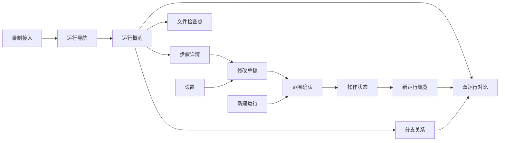
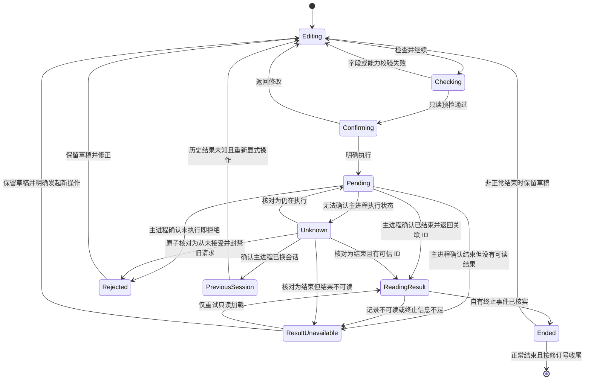

# ReBaseAgent UI 布局与交互设计 V0.2

> 日期：2026-09-19；实机走查修订：2026-09-21
> 状态：完整设计草案。用户已要求按此前方向一次性完成全部 UI 设计，不再逐项讨论。本稿选择具体默认方案供后续整体评审、原型验证与实施拆分；不表示实现已启动或 P1 已验收。
> 文档职责：统一维护 UI 信息架构、全部主要页面、操作流程、状态、响应式规则及验收场景。保留原文件名以维持链接稳定。
> 上位规划：[可用性完善规划](2026-09-15-usability-improvement-plan.md)规定可用性流程及验收；[隔离重跑演进路线](2026-09-16-isolated-rerun-roadmap.md)规定范围、排序与打包安排。实现契约和完成状态以源码及 OpenSpec 为准，本文件不替代上述文档。
> 整理记录：从可用性完善规划原 §8 独立摘出；本轮将已讨论内容整合为设计基线，补齐 §9–§20。早期示例草图只作讨论资料，本稿为后续原型的设计依据。
> 自审修订：已按 [V0.1 自我审阅](../../reviews/2026-09-19-ui-layout-design-review.md)落实 4 项 P2 的设计修订，补齐请求与运行结果分层、未知操作核对、只读详情降级及模型/运行标识。新增契约列入 U 基础依赖，尚未实现或验收。
> V0.2 实机修订：A3-A/B/C 已全部归档。本轮实际运行当前 Electron 开发版并提交受控模型请求，按[走查报告](../../reviews/2026-09-21-ui-usability-walkthrough.md)回填 11 组问题及回归场景，汇总见 §21。现有提案及归档保留，不在本轮修改产品代码；走查不是新 UI 验收。
> Change 规划：已形成 [U1–U8 拆分计划](2026-09-21-ui-change-split-plan.md)，维护工程范围、依赖、spec 归属和逐段验收。本稿 §20 只保留对应摘要；当前尚未创建活动 change 或启动实现。

## 1. 背景与确认状态

V0.1 在 A3-A 已完成、B/C 待推进时形成；V0.2 的当前基线是 A/B/C 均已归档，隔离创建、续跑和文件视图均已有实现。U 在这些已有能力上统一体验，不重新安排 B/C 开发。实现状态及契约仍以源码和 OpenSpec 为准，不以本稿修改已归档事实或建立发版承诺。

| 事项 | 本轮状态 | 结论或边界 |
|---|---|---|
| 首次打开运行的默认页面 | 已明确确认 | 默认进入概览 |
| 概览的信息顺序与状态适配 | 本轮已认可，待原型验证 | 见 §3；以输出或错误为主体，保留变化、消耗及证据跳转 |
| 设计依据 | 已明确确认 | 面向目标开发者的共同任务，不以维护者个人操作习惯决定默认交互 |
| 产品组织方向 | 已认可，继续细化 | 以运行为导航对象，以概览为默认入口，以步骤和文件为证据，以重跑和对比构成主要操作闭环 |
| 完整改造范围 | 已明确需要全面讨论 | 覆盖导航、创建、阅读、编辑、执行反馈、文件、分支对比、配置及基础交互，不局限于概览 |
| 整体布局与页面规则 | 纳入本轮完整设计 | 见 §4、§17，后续整体验证 |
| 运行列表的信息层级与父子关系 | 纳入本轮完整设计 | 见 §7，选择默认方案，不再等待逐项确认 |
| 步骤页阅读、编辑与重跑 | 纳入本轮完整设计 | 见 §9，保留各执行路径的能力门禁 |
| 创建、接入、执行、文件、分支对比、设置和异常状态 | 已有完整设计，补入当前走查 | 见 §10–§21；区分已交付 A3 能力、U 待实现交互与后续能力 |

对话中已展示使用示例数据的可切换布局草图，用于讨论概览、步骤、文件和对比的空间关系。该草图不是应用实现，不执行真实任务，不构成桌面操作、窄窗口或完整状态验收证据。

## 2. 设计依据与核心流程

目标用户是需要排查多步 Agent、尝试修改并验证结果的开发者。当前没有足够用户研究支持“大多数开发者已经这样使用”的结论；以下是基于调试任务的设计假设，后续按[可用性完善规划](2026-09-15-usability-improvement-plan.md) §5 的试用口径验证。

| 开发者需要回答的问题 | 界面应提供的信息或路径 |
|---|---|
| 这次执行发生了什么 | 任务、运行状态、最终输出、结束原因 |
| 哪里值得检查 | 已记录的错误、相关步骤、文件变化和执行消耗；不凭空推断异常 |
| 当时为什么会这样 | 模型输入、工具参数、工具结果和已记录的历史文件状态 |
| 我可以改变什么 | 与对象关联的编辑入口、执行条件及范围 |
| 改完有没有效果 | 修改前后内容、新旧输出、文件差异、错误变化与同口径执行消耗 |

主操作闭环为：**打开运行概览 → 定位步骤或文件 → 查看证据 → 修改受支持的内容 → 确认范围并重跑 → 查看新结果 → 与原运行对比。**

首次理解与熟练排查都应可达：表层使用运行、步骤、输入、工具结果等名称，完整请求、原始字段、配置指纹和 ID 按需展开。技术信息保持可查，不能因简化显示而丢失原始事实。

## 3. 概览页方案

状态：概览优先及本轮提出的信息顺序、状态适配和跳转方向已获认可；具体布局、数据派生和交互细节仍需原型及契约验证，不表示实现或验收完成。

采用纵向阅读结构，默认顺序为：**任务与状态 → 输出或错误 → 本次修改与文件变化 → 执行消耗 → 可展开的详细信息。**

1. 任务与状态：用户要做什么，当前运行中、已结束、失败还是中断。
2. 最终输出或失败原因：占主要阅读空间；失败原因可直接定位到对应步骤。
3. 本次修改与来源：分支运行显示修改内容、直接父运行及继续边界；原始运行不显示无意义的分支区块。
4. 结果入口：按实际能力提供查看步骤、文件变化及与原运行对比的入口。
5. 执行消耗：显示耗时和 token，详细统计口径按需展开。

布局保持稳定，重点随状态变化：执行中突出可靠阶段和等待时间，失败突出已记录原因，正常结束突出输出，分支突出修改与比较入口。错误、文件变化、修改记录应能直接跳到对应证据，避免进入详情后再次查找。

顶部固定显示任务摘要和状态，第二行显示时间、执行模式与来源；分支运行显示可点击的父运行和修改类型。完整 ID、模型参数等放入可展开信息。标题区保留查看分支、与父运行对比等运行级操作，编辑具体内容从对应步骤进入。

| 状态 | 主体首先显示 | 主要操作 |
|---|---|---|
| 运行中 | 可确认的当前阶段、已等待时间、最近活动 | 查看当前步骤；实际支持时可停止 |
| 正常结束 | 已记录的最终输出、结束原因 | 查看步骤或文件变化 |
| 执行失败 | 已记录的错误、失败位置、已有结果 | 定位失败步骤 |
| 进程中断 | 中断状态、最后记录的位置 | 查看最后步骤 |
| 历史信息不完整 | 已有内容和明确的缺失项 | 查看可用轨迹 |

缺少结束记录不能直接判定仍在运行；显示活跃状态需要可靠的执行状态依据。失败不能遮住已有有效输出，失败前内容须与最终输出区分。

状态判定优先读取可靠的本会话执行信息和持久终止事件。记录已封存仅表示执行结束：`error` 显示出错终止，`max_iterations`/`budget_exceeded` 分别显示具体上限原因，`aborted` 显示已中止，正常结束显示已结束；未知 reason 保留原值。曾出现工具错误但后来正常结束时，状态仍依据终止事件，另显示已记录工具错误数，不擅自改成整个运行失败。

IPC 成功只表示该请求返回了有效结果，不证明新运行正常结束。操作完成提示及草稿处理必须使用 §12 核实的本 run 自有终止事件；即使请求成功返回 ID，也不能在读取结果前提示执行成功或清除草稿。

本次变化使用紧凑摘要：修改记录标明调用与字段并可查看原值和新值，文件变化按 C 的本运行初始状态与检查点口径呈现，来源标明直接父运行及继续边界。修改工具返回文本不等于修改文件内容，文件摘要必须来自实际检查点。

执行消耗默认展示本次新增执行的耗时和 token，缓存、继承前缀、沿链累计等口径按需展开；未知值不补零。普通文本正常排版，代码保留格式，长内容可展开和复制；呈现真实记录，不额外调用模型生成结果总结。

建议返回已看过的运行时恢复页签、选中对象和滚动位置；从错误或修改记录进入时直接定位对应步骤。新运行完成后保留返回父运行的路径；用户已经切换任务时，通过通知及跳转入口提示完成，不强行切走当前阅读内容。

文件入口定位到相应检查点；返回概览时恢复阅读位置。失败后保留已有轨迹与编辑草稿，草稿生命周期和存储范围在编辑流程中细化。

必须区分运行结束、模型声称已修复、文件发生变化和测试通过。B/C 不提供真实测试能力，不能将执行完成呈现为修复成功。历史缺失信息明确标为未知或未记录；无法预测时间时不显示虚假完成百分比。

## 4. 整体布局与导航建议

采用 **顶部全局栏 + 可折叠运行导航 + 主工作区**。具体尺寸见 §17，页面间状态见 §18；整体结构需经后续原型验证。

| 区域 | 内容 | 建议规则 |
|---|---|---|
| 顶部全局栏 | 产品名、新建运行、录制接入及状态、设置 | 高度紧凑，跨页面位置稳定 |
| 左侧运行导航 | 搜索、必要筛选、运行记录 | 支持收起；当前运行可辨认；摘要优先于技术 ID |
| 主区顶部 | 当前任务、状态、来源、运行级操作 | 切换步骤和文件时保持运行身份稳定 |
| 主区内容 | 概览、步骤、文件 | 使用平级页签，每次聚焦一种阅读任务 |
| 临时操作区 | 编辑、重跑确认、执行反馈 | 与当前对象关联；草稿生命周期见 §9.5，执行反馈见 §12 |

页面组织建议：

- 上下文预算放在模型调用详情中；原始数据在对应对象中按需展开，不为每项功能增加主导航入口。
- 文件页按实际能力呈现：普通对话运行可以不显示；隔离运行附件缺失时保留入口并明确异常，不能伪装为没有文件记录。
- 从当前运行来源区域进入分支关系，默认定位相关分支；完整分支树使用宽幅视图。查看节点、打开运行和加入对比是不同操作，需要明确行为。
- 从与父运行对比或选择两个运行进入独立对比视图，清楚标出左右对象并支持交换；退出后恢复原阅读位置。
- 步骤页内部使用步骤目录与调用详情，文件页内部使用文件列表与差异内容。目录可收起、宽度可调整；避免运行导航、步骤、详情、编辑区长期四栏并排。
- 进入文件页时不常驻步骤目录，文件页使用完整主工作区。目录和 diff 按各自实际可用宽度布局，不能在文件页仅剩约 320px 时仍固定分出 288px 文件目录。此项已有 1024px 视口下正文不可读的实测，见走查 R1。
- 窄窗口优先折叠辅助导航，目录改为可打开面板，diff 改为单列；正文和按钮保持可读字号，不靠整体缩小容纳内容。
- 编辑入口靠近工具结果或受支持的输入；检查点与差异显示控制属于文件页；执行范围与本次授权属于重跑确认区。
- 从创建或编辑流程进入设置解决配置问题后，应能返回并保留输入；新建运行与接入已有 Agent 都有清晰入口。

文件页和运行对比不能混淆基线：C 的文件差异是本运行初始状态与所选自有完成步骤的比较，不自动等同于父运行与子运行的文件比较。

## 5. 完整 UI 设计范围

本表是设计核查范围，不代表所有项目都进入首个 U change；首轮实施仍遵循[可用性完善规划](2026-09-15-usability-improvement-plan.md) §3 和路线的范围及优先级。

| 区域 | 需要细化的内容 |
|---|---|
| 全局布局与导航 | 全局、运行、步骤三个操作层级；返回路径；侧栏折叠与宽度 |
| 运行列表 | 摘要、来源、模式、状态、时间、搜索筛选、父子关系及长名称 |
| 概览 | 输出、失败原因、来源、修改和消耗；按状态调整重点 |
| 步骤阅读 | 轮次、模型与工具调用层级；错误和修改定位；参数、上下文、长文本 |
| 修改与重跑 | 原值与新值核对、草稿、放弃修改、重复提交、范围确认及禁用原因 |
| 新建运行 | 任务与高级参数分层；模式、目录、授权；缺配置后的返回 |
| 执行反馈 | 即时提交反馈、可靠阶段与等待时间、完成及失败落点、实际支持路径的取消 |
| 文件查看 | 检查点、文件列表、文本 diff；新增、修改、二进制、缺失与损坏状态 |
| 分支与对比 | 关系阅读、对象选择、节点行为、修改及输出比较、消耗口径 |
| 配置与录制 | 模型接入、执行参数、代理分组；区分已保存、配置完整和连接验证成功 |
| 视觉与基础交互 | 字号、间距、按钮层级、图标、语义色、焦点、禁用原因；空数据、加载、错误、长内容及窄窗口 |

正文采用 14px，代码采用 13px，辅助信息采用 12px；尺寸及窄窗口规则统一见 §17。颜色、图标及字体服务于状态辨认和内容阅读，不代替操作及反馈流程的设计。

## 6. 与 U、B、C 的实施关系

| 归属 | 职责 |
|---|---|
| U 独立可用性变更 | 运行导航、概览、步骤阅读、就近编辑、状态反馈、返回位置、双运行对比及基础视觉交互 |
| B（已归档） | 已交付隔离创建、模式选择、目录、每次授权、来源和隔离重跑确认；U 复用现有契约并统一导航与状态 |
| C（已归档） | 已交付只读文件 IPC、检查点、文件列表、diff 和附件异常；U 调整承载布局与阅读状态，不重写文件事实来源 |

先根据当前走查形成完整流程与关键页面原型，再按 U 职责分批实施。普通与隔离运行从首轮一起验证，B/C 作为已有能力回归；新增行为通过后续 U OpenSpec 明确变更，不回写已归档 B/C 的任务和验收。本轮仅回填方案，保留现有提案。

B 的确认区须明确直接父运行、编辑工具、所属 step、本地轮号与轮末继续边界。修改工具返回文本只改变模型观察，所选工具不重新执行，已有写入不撤销；副本写入每次单独授权，历史授权不自动沿用。执行中是否提供取消，以真实执行路径是否支持为准。

### 6.1 本轮核查的能力边界

依据 2026-09-21 的 `apps/desktop/src/shared/ipc.ts`、`store.ts`、创建/设置/文件组件和 A/B/C 归档核对；动态证据范围以走查报告为准，静态核对不冒充实机验收。

| 能力 | 当前事实 | 本稿处理 |
|---|---|---|
| 原生创建、普通 result fork、prompt fork、代理消息重发、模型 A/B | 已有桌面入口和请求契约，具体可用性有各自门禁 | 重组展示及交互，不扩大执行权限 |
| 隔离创建及 result fork | A/B 已归档；本轮从 UI 完成创建、写入及成功/失败续跑 | 复用预检和每次授权，改进草稿、确认、结果核实与跨页状态 |
| 文件检查点和 diff | C 已归档；本轮实际查看初始/自有完成步骤及文本 diff | 优先修复正文空间、默认检查点和阅读状态恢复；不用祖先快照或当前源目录替代 |
| 操作关联、状态核对和主进程执行门禁 | 当前没有统一 operationId、操作查询或执行槽契约 | 作为 U 调试闭环的基础依赖先交付，见 §12.3；不承诺仅靠现有长请求可靠恢复 |
| 取消、实时步骤订阅、跨进程重启的任务恢复 | 当前 WindowApi 没有相应通道 | 显示等待和已核实结果；这些增强继续后置，与同一主进程内的状态核对区分 |
| 缺父链的部分详情读取 | 普通 result 分支当前会整体读取失败，代理/prompt 路径已有不统一的降级 | U 基础增加统一的完整性标记及只读自有记录降级，见 §18.4；B/C 不承担新增兜底职责 |
| 模型配置连接测试 | 当前只有读取、保存和清除配置 | 显示“已配置”，不显示“连接成功”或无效测试按钮 |
| 列表来源 | 当前明确区分代理与非代理，非代理不能可靠细分桌面/SDK | 使用“代理录制 / 本地记录”，不猜测具体接入方式 |
| 列表读取 | 完整解析，可能等待；没有持久摘要缓存或实时监听承诺 | 合并刷新请求，保留旧列表，不高频扫描 |
| Trace-as-Test、结果导出、Shell/构建验证 | 部分属包/CLI，导出和真实测试属后续路线 | 本轮不虚构桌面入口，不显示测试成功、应用补丁等动作 |

### 6.2 导航结构

设置返回草稿只是可能的来源路径，实际返回点由进入设置时的位置决定。分支与对比是工作区视图；概览、步骤、文件是单运行视图。目录页签、全局入口和执行动作不混用同一导航层级。

## 7. 运行导航与列表建议

状态：纳入本轮设计基线，待原型验证。目标是帮助开发者找到运行、区分多次尝试，并在切换时保留阅读位置。

### 7.1 单条记录的信息层级

| 位置 | 内容 | 目的 |
|---|---|---|
| 第一行 | 任务摘要，最多两行 | 先辨认执行的任务 |
| 第二行 | 模型、状态 | 直接区分模型实验与结束情况 |
| 第三行 | 稳定短 ID、创建时间 | 区分同模型同任务的多次尝试，不依赖时间唯一性 |
| 第四行，分支按需出现 | 修改类型及可点击来源；实验记录带实验组标识 | 辨认真实来源关系，不能用当前排序编号充当臂身份 |

列表摘要直接使用 `RunSummary.task`，仅在展示中折叠空白并限制两行，原值不变；缺失或纯空白时以“代理录制/本地记录 + 创建时间 + 短 ID”回退。搜索仍匹配完整 task 和 ID，不为每条列表记录额外加载详情或调用模型。详情已有完整数据时可显示首条有效用户输入作为任务依据，但不后台改写列表标题。完整 ID 可复制、可搜索，不占主要视觉位置。

模型直接使用 `RunSummary.model`，空值标为未记录，不借用当前设置。每条记录的短 ID 常驻：以完整 run ID 的尾部片段起步，在全部已加载记录中碰撞时延长到可区分；缩短显示不改变对象身份，不因排序或筛选重新编号。完整 ID 通过复制和展开可得。实验臂使用该 run 标识区分，同模型不同参数仍能辨认；参数差异按需进入对比，不把完整参数载荷塞入列表。

窄侧栏先压缩时间和来源的视觉权重，模型允许换行，状态和短 ID 保持可见；不退回到只剩相同任务名的布局。来源行不覆盖模型和标识。长模型名、同时间戳以及短 ID 碰撞均进入验收。

### 7.2 排序与父子关系

建议父子运行保留独立记录，默认按创建时间倒序，让最近一次重跑容易找到且顺序可预测。分支记录附上简短来源，例如“工具结果修改 · 来自原运行”，点击来源可跳转；完整关系交给分支树。

首版不把运行列表做成多层折叠树：连续分叉会挤压行宽，新记录也可能隐藏在折叠节点中。“查看相关分支”临时筛选同一已知根运行下的记录；遇到父链缺失，仅展示可确认的连通部分并标明“关系不完整”。筛选栏显示当前范围及清除按钮，退出恢复此前筛选和滚动位置。

关系必须来自真实分叉元数据，不能因为任务文本相同就自动归组。项目分组、标签、收藏和复杂管理仍按可用性规划暂缓。

### 7.3 搜索与筛选

| 维度 | 建议范围 |
|---|---|
| 搜索 | 任务文本和运行 ID |
| 执行状态 | 运行中、已结束、失败、中断等，以实际数据为准 |
| 来源 | 全部、代理录制、本地记录；不将本地记录等同于桌面创建 |
| 执行模式 | B 接入后提供全部、隔离文件、非隔离、未知；具体纯对话能力在详情中判断 |

搜索框常驻，其余条件收进一个筛选菜单，选中条件在菜单外可清除。来源和执行模式是不同维度；仅依据主进程完整校验后的摘要筛选，B 新增模式字段需同步列表 IPC，不以 N 次详情读取补齐。所有未识别状态保留可见，不能给旧数据补造模式。筛选后无结果时提供清除筛选入口。

### 7.4 选择、更新与比较

新运行出现时保留当前选中项和阅读位置，不因刷新强制跳转。选中状态与悬停、失败颜色明显区分；普通点击始终打开运行，多运行比较通过明确的“选择对比”操作进入。

列表负责找记录，来源标记帮助辨认关系，分支树负责完整关系探索。刷新时保留现有列表，显示刷新状态，重复刷新合并；只在启动、明确刷新和操作完成等事件触发，不对所有 trace 高频轮询。代理外部新记录在当前版本通过刷新发现，不显示虚假实时计数。

筛选隐藏当前运行时，主区继续展示，列表顶部提示“当前运行不在筛选结果中”并提供清除筛选入口。当前记录被移除时，已加载内容标为“源记录不可用”，禁用执行；选择其他记录后正常离开。刷新失败保留上次列表并标记未更新；首次失败显示重试。单个损坏文件在列表末尾的“无法读取的记录”分组中呈现，不阻塞正常记录。

## 8. 完整设计导航

用户已要求一次性完成全套设计，以下章节为连续设计方案，不再逐项等待确认。后续以整套原型和场景走查评估，并按 §20 拆分实施。

| 内容 | 章节 |
|---|---|
| 概览、整体布局、运行导航 | §3、§4、§7 |
| 步骤阅读、编辑、草稿及执行语义 | §9 |
| 新建运行、录制接入 | §10、§11 |
| 执行状态与通知 | §12 |
| 文件检查点与差异 | §13 |
| 分支关系、对比、现有模型实验 | §14、§15 |
| 设置、视觉与响应式 | §16、§17 |
| 导航状态、异常处理、完整验收 | §18、§19 |
| 实施分组及交付边界 | §20 |

已认可方向、工程约束和本轮选定方案的来源仍可区分，但未逐项讨论的设计不因此悬置。完整交互原型、实现、真实执行验证和外部试用属于下一阶段工作。

## 9. 步骤页阅读、编辑与重跑建议

状态：纳入本轮完整设计；阅读、编辑和执行边界按以下规则进入后续原型。

### 9.1 目录与阅读区

采用可折叠的步骤目录与宽幅详情区。目录按已记录轮次分组，组内列出模型调用和工具调用；选中行打开详情，展开箭头单独控制目录，避免选择与折叠互相干扰。目录顺序不能让并行调用被误认为串行因果关系。

目录显示调用类型、工具名、状态及辅助耗时；可提供错误定位和调用搜索。跨来源展示时标明所属运行，区分继承前缀与本次执行；轮号保留所属运行的本地口径，不沿父链累加。缺失父链或不适用共享前缀语义的运行不能伪造连续历史。

### 9.2 按对象呈现详情

| 对象 | 默认阅读内容 | 次级信息 |
|---|---|---|
| 轮次 | 本轮已记录调用、错误和消耗摘要 | 原始标识及来源 |
| 模型调用 | 输入消息与输出，保留角色、顺序和代码格式 | 模型参数、用量、缓存、上下文预算与原始请求 |
| 工具调用 | 工具名、输入参数、返回结果或错误 | 来源、耗时与原始字段 |

长内容可展开、搜索和复制，结构化数据可格式化阅读，但保留原始内容的访问路径。工具调用的输入与返回结果保持在同一详情中方便核对；模型长上下文与输出可在详情内切换，避免无边界长滚动。

### 9.3 就近编辑与范围确认

工具返回结果旁提供“修改后重跑”。只有当前运行和字段支持相应操作时才能进入执行流程；相关但不可用的操作说明具体原因，隔离父本不开放 prompt fork/A-B。不将查看工具参数误呈现为支持参数修改或工具重执行。

编辑在当前详情区内展开，保留原值只读，新值为草稿；宽窗口可并排核对，窄窗口上下排列。原 trace 始终不变。进入编辑不执行任务，提交前先核对修改与继续边界，执行仅由最终明确确认触发。

切换页签、步骤和运行时保留当前会话草稿，按运行、调用和字段索引；除 §9.5 核实正常结束后的对应修订收尾外，只能通过明确放弃清除。跨应用重启的草稿持久化不进入本轮实现。

确认区展示实际分叉父本、字段位置、所属轮次、继续边界与授权。浏览到祖先记录不能自动改变执行对象；继承步骤能否作为分叉起点以现有能力预检为准，不能从目录位置推断。B 的 result 修改从所属完整轮次结束后继续，所选工具不重新执行且原写入不撤销。

### 9.4 定位与返回

从概览错误或修改记录进入时，展开相关轮次并定位具体调用及字段；普通进入步骤页优先恢复该运行上次选择，首次进入且没有定位目标时选择首个自有可读调用，缺失时回退到首个可读记录。错误提供明确的跳转入口，不擅自断言第一个错误就是根因。

窄窗口收起目录，保留当前轮次和调用身份以及重新打开目录的入口。提交后阻止重复执行，保留当前对象和草稿；失败可继续修改，成功可查看新运行并与父运行比较。执行反馈统一见 §12。

### 9.5 草稿与提交

草稿仅存在当前应用会话内，不写封存 trace 或设置文件。草稿键为运行 ID、调用 ID 和编辑字段；修改状态在对应调用旁显示，步骤页标题可打开本运行草稿列表。切换步骤时自动保留，不弹反复确认。一次操作只提交一个编辑目标，其余草稿不自动合并。

编辑器操作为“放弃修改”和“检查并重跑”。无变化时禁用提交并显示原因；空字符串是否可用按该字段契约判断，不能对所有字段统一禁空。放弃非空变更需要一次确认。关闭编辑区保留草稿，明确的放弃动作才删除。

仅当该次操作关联的持久记录已通过校验，且自有终止事件确认为正常 `completed` 时，自动清除该次提交对应的草稿；这不表示任务质量已验证。错误、上限结束、中止、记录读取失败、未识别终止原因或执行结果未知时均保留草稿。模型实验仅在全部预期臂都有已定位记录且正常结束时清理批次草稿，部分失败时保留整份实验配置。

每次提交绑定草稿键和提交修订号。只有仍与提交修订号一致的草稿可被清理，迟到结果不能删除用户后来修改的内容。运行结果读取待重试但操作已确实结束时可继续修改，重新提交前重新授权。提交期间冻结该草稿，其他运行仍可浏览；不把编辑器卸载当作取消或清除操作。原记录变化、消失或预检失败时草稿可复制，但执行被阻止。

退出应用且存在草稿或在途操作时给出一次退出确认：分别说明未保存草稿和仍在执行的操作，允许返回；不提供未实现的恢复承诺。该主进程关闭拦截属于 U 新任务，实施前不能把现有退出行为算作已支持。

### 9.6 不同重跑入口的语义

| 类型 | 入口与编辑对象 | 确认区必须说明 |
|---|---|---|
| 普通工具结果修改 | 工具结果旁编辑 result | 修改模型观察，按现有 replay 契约继续；后续真实工具调用可能产生外部副作用，不标为隔离执行 |
| B 隔离工具结果修改 | 隔离运行的受支持工具结果旁 | 直接父运行、本地轮号、整轮结束检查点；不重做所选工具，不撤销原写入；每次副本授权 |
| 普通 prompt 修改 | 首次模型调用的启动输入旁 | 一次修改 system 或首条 user 之一，从头重跑、不共享执行前缀；遵守当前可重建条件 |
| 代理消息重发 | 代理模型调用的输入旁 | 编辑完整 messages 后重发这一请求，不运行外部 Agent 工具，不恢复其工作区；需要当前会话可用凭据 |
| 模型 A/B | 支持的运行标题菜单或首次模型调用 | 多个独立运行、从头执行，先预览计划再明确执行；细节见 §15 |

没有资格的已知操作保留说明入口或就近原因，不以 tooltip 作为唯一信息来源；完全无关的操作不展示。隔离父本的 prompt/A-B 始终受包与 IPC 门禁约束，普通路径不能成为降级出口。返回配置页或修改执行对象后必须重新预检。

确认区返回编辑、更换父运行或修改内容、进入设置后返回、执行失败后再次请求，都使之前的隔离写入确认失效，复选框重新置为未选。预检结果只适用于当时的对象和配置，不能作为之后请求的持久授权。

## 10. 新建运行

### 10.1 页面结构

顶部“新建运行”打开主工作区内的创建页面，左侧运行导航保留；取代承载全部执行过程的小弹窗。页头提供返回来源位置，正文为单列、最大阅读宽度 800px 的表单，底部在页面滚动区内保持操作可达。

| 顺序 | 控件 | 默认与行为 |
|---|---|---|
| 1 | 纯对话 / 隔离文件分段控件 | 默认纯对话；隔离模式已由 B 交付，按现有请求契约接入 |
| 2 | 任务文本域 | 必填，标题由任务文本派生，不新增独立 task 写入字段 |
| 3 | 隔离源目录 | 隔离模式显示，使用原生选择器；路径可换行并可重新选择 |
| 4 | 模型与接入摘要 | 显示当前已保存配置；缺失时提供配置入口 |
| 5 | 高级设置展开区 | 可选 system prompt；只展示当前契约实际可配置的字段 |
| 6 | 本次执行范围与授权 | 模式相关的边界说明，隔离写入复选框默认未选 |
| 7 | 返回 / 创建并运行 | 提交前检查必要字段，提交后冻结本次草稿 |

不在表单中凭空增加每次请求的模型、配额或预算覆盖输入。若后续支持这些字段，应先扩展受验证的请求契约。已有配置参数仍可从设置查看和修改，返回后保留创建表单。

走查 R10 已确认隔离模式显示当前模型、纯对话模式未显示，修订时应统一两者；不能把已实现的隔离摘要重新列为缺失。字段名使用任务与系统指令，`config_hash`、空工具表等内部解释移到按需展开信息；采集范围、源目录不被修改、文件文本进入模型请求及本次授权继续在决策位置明确呈现。

### 10.2 隔离目录与授权

目录选择只记录会话引用，不提前导入文件或创建运行。取消选择器不清空原先有效选择；首次取消保持未选。sourceToken 依 B 契约在会话内有效 15 分钟，成功提交消费；提交预检判为失效时提示重新选择，任务和 system prompt 保留。

更换目录、切换模式、重新发起执行或执行失败后，副本写入授权复选框重置。保留明确的范围信息：会采集选择范围内受支持的普通文件，包括隐藏文件；工具读取的文本可能进入已配置模型请求；写入限于分支副本，不回写源目录。它们是执行决策信息，不藏在帮助文档里。

目录过大、含不支持对象、路径无权限或和 dataDir 冲突时，显示包预检返回的原因，不在 renderer 重新定义文件世界规则。没有实际采集预览接口时，不显示估算文件数、大小或假预检成功。

### 10.3 提交与返回

有效提交进入 §12 的操作状态；尚未获得持久 run ID 时显示“创建操作”，不将临时项混入运行列表。预检失败保留表单并定位对应字段。操作关联必须通过主进程登记的 runIds，不解析错误文案或猜测列表最新记录。执行失败后若真实失败记录已落盘且被关联，则提供打开入口；尚无可信 ID 时提供查看记录及核对操作状态，保留结果未定位的事实。

已定位运行记录且用户仍停留在该创建流程时可以进入新运行概览，按真实终止原因显示状态；打开记录不代表请求或运行成功。用户已经离开则通知有结果可查看，不改变当前阅读位置。返回可暂存当前会话的一份创建草稿；再次点新建恢复草稿，清理条件遵循 §9.5，并提供明确放弃入口。重新开始操作时授权重新勾选。

## 11. 录制接入

录制是独立的全局工作区，不与桌面模型配置挤在一个长对话框中。页头显示代理当前监听状态；页面依次呈现接入配置、可复制的本地地址、当前会话凭据状态和已录制记录入口。

| 区域 | 设计 |
|---|---|
| 代理配置 | 端口数字输入、上游地址输入；启用意图用开关，修改后通过“保存并应用”提交 |
| 实际状态 | 分别显示已启用与正在监听，不能把用户开关意图当成服务已启动 |
| 接入地址 | 仅在真实监听成功后显示当前地址与复制图标；服务失败时保留配置草稿及原因 |
| 凭据状态 | “本会话尚未收到凭据 / 本会话凭据可用”；不显示凭据值 |
| 记录入口 | “查看代理记录”切换运行列表来源筛选；提供明确刷新动作 |

录制启动不自动发出测试模型请求，不伪造“已接入某 Agent”。`hasKey` 只能说明收到可用凭据，不等于上游连接经过独立验证或最近请求成功。当前没有最近请求时间、速率或实时订阅契约，因此不显示这些仪表。

端口占用、上游地址非法等错误显示在对应配置处，失败不清空输入。停止代理是停止本地接入服务，不能用“取消运行”称呼，也不能承诺外部 Agent 或在途请求立即终止。重启后原会话凭据不可用时，消息重发入口显示重新接入所需的具体原因。

已录制的模型请求能查看和按条件重发，但不能据此重建外部 Agent 的工具实现、文件历史或完整运行世界。SDK 接入继续指向现有项目文档，本轮不设计一个声称能自动适配任意项目的向导。

## 12. 执行反馈与操作状态

### 12.1 状态流

Checking 只显示确实正在做的校验，不额外调用模型。不同路径没有独立预检接口时，确认前仅完成本地已知检查，标注正式提交仍有主进程校验；不能用“检查通过”承诺后续一定可执行。B 的只读预检按其契约由 main 执行并在提交时重验。

### 12.2 请求结果与运行结局分层

当前长请求的响应不能直接作为业务成功判据：普通 result/prompt 分叉可能在模型失败后仍返回成功信封和 ID，原生创建则可能返回 CREATE_RUN_FAILED。统一先核对主进程操作状态，再根据可信关联 ID 读取经校验的自有终止事件。信封 ok、记录已定位、运行正常结束是三件不同的事。

提交后立即显示操作类型、对象、等待计时及真实请求状态；计时是从提交开始的等待时间，不冒充模型耗时。实时步骤事件仍不属于本轮基础能力，没有事件就不播放预设阶段或百分比。操作状态入口位于全局栏，页面离开或关闭面板不清除操作；renderer 只维护订阅、展示和草稿关联，执行槽和操作登记由 §12.3 的 main 持有。

开始执行后冻结提交草稿和执行配置，只读浏览保持可用。主进程确认执行及收尾结束后刷新一次列表；结果记录可按已知 ID 独立读取，不因列表刷新失败而重发执行。执行槽按主进程是否仍在执行释放，不等待结果页成功渲染；如果执行已结束但结果暂不可读，该操作不再占槽，草稿保留，并显示“执行已结束，结果待读取”。全局执行/配置是否解锁始终以 main 当前槽为准，不解除其他操作的占用。

| 结果 | 展示与下一步 |
|---|---|
| 信封返回 ID，但记录尚未读取 | 显示“正在读取结果”，不提示运行成功，不清草稿 |
| 自有终止事件为正常 completed | 显示已结束；按 §9.5 清理相同修订草稿，不声称质量验证通过 |
| 自有终止事件为 error | 显示失败及原因，保留草稿；即使信封 ok 也不转正常完成 |
| 迭代/预算上限或 aborted | 显示具体结束原因，保留草稿，允许结束后重新编辑 |
| 已封存但 reason 未识别或缺少必要信息 | 显示结束原因未知，保留原始值及草稿，不补成正常结束 |
| 提交前确认拒绝 | 字段/能力错误，无新运行；本次不占槽，保留草稿，不解除其他操作的占用 |
| 失败信封但有 main 登记的运行 ID | 读取对应失败记录，信封诊断和终止事实分别呈现，不解析错误字符串找 ID |
| main 已结束但无可读记录 | 保留错误及草稿；仅重试读取，执行槽已释放，不自动执行 |
| 无法核对 main 是否仍在执行 | 进入 Unknown，执行/配置保持锁定，按 §12.3 核对或重建会话 |
| 部分模型实验失败或存在未核实臂 | 列出全部已关联臂与各自状态，保留整份实验草稿，不把批次包装为全成功 |

打开结果与判断成功分开：只要记录已定位，用户仍在原操作页面时可跳到该记录概览，包括失败概览；已经离开则通知有结果可查看，不抢焦点。失败后的再次执行必须是新 operationId 的明确请求，相关授权重置并重新预检。通信重试只能核对同一操作，不能悄悄创建新执行。

### 12.3 操作登记、Unknown 恢复与门禁

这组契约是 U 调试闭环的基础任务，须在开放跨页执行和统一执行槽前交付，不归为取消或实时事件的后置增强。以下接口名及数据职责为设计要求，实施前进入 OpenSpec 和 shared/preload schema；当前代码尚不具备。

| 对象或通道 | 最小契约 |
|---|---|
| 主进程会话 epoch | 每次 main 启动生成，全窗口共用；renderer 重载不改变 epoch，不能仅靠 renderer 重载解锁 |
| 主动执行请求关联 | create、result/prompt fork、代理重发、A/B 真实执行均携带 epoch 与 operationId；UI 将它们与提交草稿修订号绑定 |
| main 操作登记 | 至少保留操作类型、对象、执行状态、可信 runIds、请求结局及脱敏诊断；不回传 prompt/密钥，不依赖组件生命周期 |
| 主动执行槽 | main 在接受请求时原子占用，执行和收尾 settled 后释放；A/B 一批一个槽，代理被动录制不占槽 |
| operations:status | 只读返回 epoch、当前执行槽及本会话已登记操作；用于启动/重载恢复关联和读取终态 |
| operations:reconcile | 按 epoch/operationId 原子核对操作；已登记时返回实际状态；从未接受时登记不可再执行的 notAccepted 终态，封禁同 ID 的迟到提交 |

operationId 在 main 会话内唯一；相同 ID、相同请求的重复到达只关联原操作，不再次调用模型或工具；相同 ID、不同请求明确拒绝。终态及封禁标记保留到该 main 会话结束，UI 关闭通知不删除登记。旧 epoch 的请求一律拒绝，正式执行仍保留原有模式、授权、版本和包预检。

runIds 必须由实际创建/分叉编排在知道 ID 后登记，含已落盘的失败运行和实验各臂；不能通过扫描时间、任务名或解析报错文案猜测。尚未取得 ID 时允许 runIds 为空，操作仍可通过 operationId 核对。主进程登记属于会话内存，不修改封存 trace 或增加持久统计事实源。

| Unknown 的核对结果 | 执行槽与配置锁 | 页面和草稿 |
|---|---|---|
| 原操作仍 running | 保持锁定，仅可浏览和继续核对 | 显示仍在执行，冻结该提交草稿 |
| main 确认 settled | 该操作不再占槽；全局是否可执行仍以 main 当前槽为准 | 有 runIds 则读取结果；读失败进入 ResultUnavailable 并保留草稿 |
| 原子确认 notAccepted | 该 ID 不占槽且迟到提交被拒绝，不解除其他操作的锁 | 明确本次未执行，草稿解冻；再次执行使用新 ID 和新授权 |
| 状态通道不可用 | 不把刷新列表当作解除锁的证据 | 保留 Unknown，允许复制草稿、只读查看和重试核对 |
| 握手确认新的 main epoch | 旧操作不占新会话槽；旧 epoch 请求不会被接受 | 历史结局仍未知，不自动重发，不恢复为活跃任务 |

无法在原 main 会话核对时，恢复边界为确认退出整个应用进程后重新启动；退出前允许复制草稿并明确会话草稿会丢失。新进程握手才能重新开放执行，重开面板或重载 renderer 都不算。重启只结束本地会话，不保证已发出的上游请求、费用或外部副作用撤销，历史操作不会因此标成成功、失败或已取消。持久记录仍按真实 ID/内容读取，未关联记录不得自动归到旧操作。

迟到响应只更新匹配 epoch/operationId 的记录，不解除另一操作的锁、不抢当前页面、不清理新修订草稿。配置保存和清除也由 main 检查执行槽，不能只依赖禁用按钮。模型预览等只读检查不占写执行槽，也不得消耗写入授权。

### 12.4 取消、关闭与恢复

当前无取消通道的路径不放停止按钮，操作详情明确当前执行不可从桌面停止。关闭操作详情只退出查看，不改变执行状态；退出应用按 §9.5 拦截确认。窗口关闭拦截也不能承诺外部副作用会回滚。

未来接通取消时使用“请求停止 → 等待终止确认 → 已停止”三个状态；只有执行层证实停止才能显示已停止，发送取消请求不等于工具副作用撤销。该增强单独进入 U 执行能力变更，不能用纯前端定时器实现。

重启后只重新读取真实持久记录。缺结束记录显示中断或状态待核实，不自动续跑，也不把历史记录恢复为本会话的活跃任务。

## 13. 文件检查点与差异

### 13.1 页面组成与默认选择

文件页顶部显示当前运行、检查点选择器和基线“本运行初始状态”。初次进入默认选择最近的自有完成步骤；没有自有完成步骤则选初始状态。来自步骤或概览的明确检查点定位优先于默认值，后续返回恢复已选检查点和路径。

这里的“返回”包括同一运行的文件 → 步骤 → 文件，以及经其他运行、分支或对比再返回；恢复检查点、文件路径、列表/内容模式与阅读位置，不因组件卸载回到初始清单。走查 R7 已复现此重置。恢复时重新校验 run/step/path 引用，不缓存为第二套文件事实。

选择器只列初始状态及本 run 自有完成步骤，名称使用“本运行第 N 轮结束”。分支起点来源另行标注父 run/step，不能把初始状态伪装成一次完成轮次。来源缺失也不从当前源目录补历史文件。

页面下方为文件表与内容区。文件表提供路径搜索和“全部 / 有变化”切换，默认有变化；初始检查点默认全部。无变化时显示“相对此运行初始状态无变化”并提供查看全部文件，不能以空表让人误以为没有文件。

### 13.2 文件行与内容

| 信息 | 规则 |
|---|---|
| 路径 | 显示逻辑相对路径，保留文件名；长目录可收缩，完整路径可复制 |
| 变化 | 新增、修改、未变化；来自清单和 hash，不使用 mtime |
| 大小 | 来自原字节长度，文本字符数不充当字节大小 |
| 可用性 | 独立于变化状态：可读、非 UTF-8/二进制、缺失、损坏等 |

当前受控工具没有删除能力，不设计删除文件操作或把缺 blob 标成文件删除。文件变化与附件损坏是不同维度，不能合并成同一个红色“变更”标记。

文本内容使用只读 Monaco DiffEditor，左侧初始、右侧所选检查点；支持原文复制、查找、换行开关、上一个/下一个差异及单列/并排切换。控件放在编辑器工具栏，用图标及可访问名称。初始与初始比较没有变化时可直接呈现单份原文，顶部仍明确两个选择的含义。

布局验收同时检查文件正文实际宽度和短句可读性，不能只验证“编辑器存在、文本完整、没有遮挡”。可用正文不足时先收起辅助目录，再选择 inline；自动 inline 仍可能被挤到几像素。首轮以当前真实 fixture 的短文本和长路径同时验证，见走查 R1。

新增文件左侧明确“初始状态不存在”，可以用空侧参与 diff 但保留不存在标识；已存在的零字节文件显示“0 B 空文件”，与不存在区分。完整文本可以滚动或折叠，不能截断后仍称完整文件。

### 13.3 异常与降级

| 状态 | 展示 | 可用动作 |
|---|---|---|
| 未录制检查点 | 没有文件历史，不生成伪空清单 | 返回步骤 |
| 合法空清单 | 当前检查点没有普通文件 | 选择其他已录制检查点 |
| 路径不存在 | 该检查点没有此路径 | 选择其他文件或检查点 |
| 二进制或非 UTF-8 | 大小、hash 和类型状态，不有损解码 | 复制元信息 |
| blob 缺失 | 附件不可用，不展示空文本 | 重试只读加载、查看其他文件 |
| hash/长度损坏 | 附件校验失败，阻止无效 diff | 查看原因、重试读取 |
| 一侧可读、另一侧不可用 | 两侧分别标状态；可读侧仍可查看 | 禁止将不可用侧当空文件比较 |
| 失败运行已有检查点 | 正常显示已落盘检查点 | 不生成失败后未完成轮次 |

切换检查点后，若原路径存在则保留选择，否则显示未选文件并让用户选择，不悄悄改到另一个同名文件。快照列表读取与文件内容分别加载，重试不触发导入、模型或工具。

文件页全程只读，不放文件编辑、回写源目录、应用补丁或导出按钮。导出归后续 R2.1，其按钮位置将来可放运行级菜单，本轮不放空壳入口。

## 14. 分支关系

分支视图占据主工作区，默认聚焦当前运行所属的已知分支树，保留“全部运行关系”范围切换。运行导航可收起；图上工具栏提供适应画布、缩放、定位当前运行和搜索 ID/任务。

节点使用稳定尺寸，显示任务摘要、状态、模型及短 ID，分支边标记实际修改类型：工具结果、启动输入、模型参数或代理 messages。选中高亮与执行状态颜色分开；错误、当前运行和父链缺失均配文字或图标。

单击节点只选中，在画布旁或下方的紧凑详情区显示“打开运行”和“加入对比”；双击可作为打开运行的快捷方式，不能成为唯一入口。画布空白拖动平移，缩放只作用画布，不影响应用字体。键盘用户可切换到同数据的关系列表，仍可选择、打开和加入对比。

缺失父节点用明确的“父运行不可用”占位关系表示，不补造其任务或指标。prompt fork 和代理消息重发只表达来源，不画成共享执行前缀。模型实验按 experimentId 作轻量分组，不按同模型名推断实验组。

加入对比后底部出现选择栏，显示已选对象与移除按钮；两个对象时可进入详细对比。保留现有最多四条的指标对照能力，三或四条先进入宽幅指标表，再任选两条阅读详细差异。编号与对象位置绑定，交换时同步更新，不把轮次编号当作比较编号。

## 15. 对比与现有模型实验

### 15.1 双运行对比

对比页顶部固定左右运行选择、交换、返回来源位置；默认父运行在左、当前运行在右。没有父运行时不显示“与父运行对比”，仍可手动选择第二个运行。比较对象在当前页面内更换，不改变侧栏原运行选择。

正文分为“修改与输出 / 步骤 / 消耗”三个视图。默认修改与输出：上方一条真实修改摘要，下方并排最终输出或失败状态。缺最终输出时明确未记录，不能把最后一段中间消息冒充最终答案。

| 视图 | 内容与约束 |
|---|---|
| 修改与输出 | 直接父子关系可显示精确编辑字段和原值/新值；多跳关系显示可追踪的修改链；不同根只展示输入/配置的可核对差异，不称为某次分叉修改 |
| 步骤 | 共享前缀按真实分支语义折叠；两侧独立选择后续调用；无法可靠对齐的步骤明确独立排列，不按相同轮号强行配对 |
| 消耗 | 同口径展示各运行自有执行耗时、输入/输出 token、可得缓存数据；沿链累计和共同祖先增量单列说明 |

左右可独立滚动；只有确定文本对齐的 diff 才默认同步滚动，不让不同长度的输出强制对齐。窄窗口采用上下排列并重复对象标题，默认折叠运行导航。比较返回恢复来源页面及选择。

共同祖先分为有、无、因缺父链无法完整判断三态。不同根可以比较输出与自有指标，但共同前缀和祖先增量显示不适用；信息缺失显示未知，不补零。工具或模型错误只说明记录结果，不自动得出整体质量优劣。

### 15.2 文件比较范围

C 文件页只比较本 run 初始与自有检查点；双运行对比第一版提供分别打开左右文件页的入口，保留各自检查点，不把两份“相对各自初始变化”冒充跨运行文件 diff。

真正的跨运行文件对比仍是独立 U 扩展，C 归档不代表此项已交付：必须明确选择左右 run 和各自合法检查点，复用只读引用读取、二进制及缺失状态规则，另行增加验收后才出现“文件”比较页签。此项不扩大已归档 C 的交付契约。

### 15.3 多运行指标对照

保留现有最多四条指标对照，使用完整宽度的表格，首列指标名称固定可见，运行列显示任务摘要、短 ID、模型和状态。列过多时表格内部横向滚动，不能把指标名称压成不可见。输出阅读仍以两条为单位，不把四段长文本挤成窄列。

指标表不生成自动评分或排行榜；缓存命中未知、零命中及部分记录必须分开呈现。金额仅在有明确匹配的定价数据和计量口径时才可能计算，本轮默认只展示记录用量。

### 15.4 模型 A/B 与 prompt 修改

已有普通模型实验保留在运行级“更多操作”菜单，通过完整工作区编辑实验臂，默认两臂，允许按现有契约增加。每臂包含模型名和可选标量参数；空参数沿用父值，非法类型、保留键和空 fork 依据现有校验拒绝。

第一步“预览计划”调用现有 dry-run；展示最终参数、覆盖/新增/丢弃项及 provider 告警。变更任一实验配置后旧计划失效，需要重新预览。第二步才是“执行实验”，需要当前有效计划和实际副作用声明。预览不请求模型、不生成运行，也不显示为执行成功。

存在被允许的副作用工具时显著呈现顺序执行、前一臂可能改变后一臂外部状态的事实；不得宣称公平隔离 A/B。执行后进入实验结果列表，以真实返回 ID 读取每臂状态，提供任选两条对比；未返回或未完成的臂不补成成功。

模型实验进入共用对比视图仍遵守现行 `model-experiments`：直接 parent 相同、父链完整、已封存且前置校验通过才可作为实验比较；仅展示各臂事实和相对父 run 的累计增量，不产生臂间差值、胜出臂或最佳模型结论。§15.1 的普通不同根阅读比较不能自动放宽这些实验条件；不可比时可单独打开各记录。此项由拆分计划 U7 固定比较规则、U8 接入工作区。

普通 prompt 修改仍在首次模型调用附近，一次只编辑 system 或首条 user；从头重跑和工具结果续跑在标题及确认区明确区分。隔离 prompt/A-B 继续禁用，不能因为拥有文件页或历史授权而开放。新增隔离多臂实验仍按后续路线处理。

## 16. 设置

设置采用居中的有界对话框，桌面宽度约 640px，最大不超过可用宽度；窄窗口转满工作区表单。全局设置图标和缺配置状态均可进入；保存后可返回进入前的页面和草稿。录制接入是 §11 独立页面，设置中仅提供跳转，避免两份配置表单各自维护状态。

模型连接表单包含 baseURL、model 和密码类型的 apiKey。回读只显示是否已配置，不回传原密钥；空密钥输入明确表示保留已保存值，不把占位符当实际值提交。新配置缺密钥时按真实校验拒绝。未保存修改在关闭时提供放弃/继续编辑，保存失败保留输入。

保存按钮显示保存中并防重复提交，成功显示“已保存/已配置”，不显示“连接成功”。当前没有连接测试接口，不新增会偷偷发出付费请求的测试动作。加密不可用时保留现有明文存储事实提示；清除配置需要明确确认其同时删除保存凭据。

配置锁以 §12.3 的 main 执行槽为准：执行中或无法核对执行状态时不能保存/清除；某次操作已确认 settled 或 notAccepted 时不再因它锁定，只有 main 当前槽为空才可保存/清除。结果记录暂不可读不单独构成配置锁。renderer 禁用仅作反馈，main 同样校验。保存新配置只影响后续请求，不能回写历史运行的模型信息。

执行预算、配额等只在现有契约暴露时显示真实值；本轮不增加无后端契约的滑块。外观使用现有中性浅色作为首版视觉基线，不新增主题系统；侧栏宽度、折叠偏好属于非敏感界面偏好，可本地保存。

## 17. 视觉、控件与响应式规范

### 17.1 基础视觉

采用中性灰白工作台、深色正文、蓝色交互强调；绿色只表示已确认的正常状态，琥珀色表示限制/待处理，红色表示失败。运行正常结束不能仅用绿色大勾暗示业务目标已通过验证。状态始终有文字，不依赖颜色识别。

| 项目 | 设计基准 |
|---|---|
| 正文 / 代码 / 次级信息 | 14px / 13px 等宽 / 12px；不以 10–11px 承担主要信息 |
| 页面标题 / 分区标题 | 18px / 14px，中等字重；不使用营销式超大标题 |
| 间距 | 4、8、12、16、24px；正文行高约 1.5，代码约 1.6 |
| 全局栏 | 桌面高 48px；小宽度内容换行时允许增加高度 |
| 运行导航 | 默认 264px，可拖动 220–360px，可收起 |
| 步骤目录 / 文件目录 | 默认 232px，可拖动 200–320px；不能挤掉详情最小可读空间 |
| 按钮与输入 | 桌面主要控件高 32–36px；图标按钮至少 32px；触控目标至少 44px |
| 圆角与边界 | 输入/按钮 4px、对话框最多 8px；分区用留白和细分隔线，不叠套卡片 |
| 输出阅读宽度 | 单列文本以 800–960px 为舒适上限；代码、diff 和对比使用可用宽度 |

所有字距保持 0，字体不随视口宽度缩放。固定格式的节点、图标按钮和状态占位使用稳定尺寸，长文本换行或展开，不能让 loading 文案改变整行布局。

### 17.2 控件规则

清晰命令使用文字或图标加文字；复制、刷新、设置、缩放、面板折叠使用图标按钮和 tooltip。沿用已存在图标库；若项目尚无图标库，在 U 提案中选择 Lucide，不为每个按钮手绘 SVG。

模式用分段控件，页面内容用页签，授权和二元偏好用复选框/开关，数量用数字输入，选项集用菜单或选择器。危险或不可逆的清除操作单独放置；每个局部操作组只有一个主要提交按钮。

tooltip 只是补充，执行边界、错误和禁用原因保持可见。按钮具备名称、焦点与明确禁用态；键盘能够选择页签、展开目录、进入编辑、检查和提交。Esc 关闭最上层临时面板并将焦点还给触发入口，不丢草稿，不执行取消请求。

真正的模态框必须将 Tab/Shift+Tab 约束在当前框内并隔离背景交互；仅使用 `<dialog open>` 和遮罩不构成模态行为。走查 R11 已确认创建按钮后按 Tab 会进入背景步骤。创建改为工作区后采用页面焦点规则；仍保留的设置/确认模态框分别验证打开时的初始焦点、循环、Esc 和关闭后的焦点恢复。

### 17.3 宽度规则

| 可用窗口宽度 | 布局 |
|---|---|
| ≥1280px | 运行导航可常驻；步骤/文件目录加详情；满足每侧至少约 320px 时使用并排 diff |
| 960–1279px | 普通阅读保留导航；编辑、diff、对比进入时暂时收起运行导航，退出恢复之前状态 |
| 720–959px | 导航和对象目录使用按需打开的面板；主区单列，文本 diff 使用 inline |
| <720px | 单工作区，工具栏换行，列表与内容切换，对话框占满工作区，比较上下排列 |

面板开启时提供明确关闭和当前对象标题，不靠遮挡主操作表现选中状态。按实际内容区宽度决定 diff 模式，不能只用整窗宽度猜测可读性。应用页面不横向溢出；原始代码、图表画布、指标表可在自身区域滚动。

每页只有明确的主滚动区；目录和编辑器可独立滚动，但不出现多层相互竞争的正文滚动容器。放大到 200% 时优先换行和收起辅助区域，主要操作仍可达。

## 18. 页面状态、异常与数据边界

### 18.1 页面状态模型

| 状态 | 保存范围 | 行为 |
|---|---|---|
| 当前视图与返回位置 | 当前会话 | 记录进入对比、分支、创建、设置之前的位置 |
| 每运行页签、span、展开轮次、滚动位置 | 当前会话，按 run ID | 切换后恢复；对象不存在时明确回退，不显示错误对象 |
| 文件检查点和路径 | 当前会话，按 run ID + 自有 step | 重新读取必须验证引用，过期选项不借用祖先数据 |
| 编辑与创建草稿 | 当前会话内存 | 不放 URL、日志或持久偏好中；生命周期见 §9.5 |
| 授权复选框和 sourceToken | 当前操作/受限会话 | 不持久恢复，不从历史记录继承 |
| 面板宽度及折叠偏好 | 可本地持久化 | 只保存界面偏好，自动折叠不覆盖用户的宽窗口偏好 |
| 活跃操作及返回结果 | main 会话登记，renderer 展示关联 | 用 epoch/operationId 核对及恢复；页面卸载不销毁，main 重启后不伪造旧操作结局 |
| 提交草稿关联 | renderer 会话内的草稿键和修订号 | 迟到结果仅处理对应提交，不能清除之后的修改 |

快速切换运行、检查点或文件时，结果必须与发起时的对象标识匹配；旧响应只能更新其所属缓存，不能覆盖当前对象。请求失败与加载中的旧内容清楚标记，不允许标题已切到 B 而正文仍无提示地显示 A。

### 18.2 状态与空页面

| 情况 | 页面处理 |
|---|---|
| 首次没有运行 | 主工作区提供“新建运行”和“录制接入”两个实际入口，无独立营销欢迎页 |
| 未选择运行但有记录 | 默认选择最近的可读运行并进入概览；加载失败不循环重试跳转 |
| 首次列表加载 | 保持布局，显示明确加载状态；不生成假记录 |
| 筛选无结果 | 保留搜索及条件，提供清除筛选 |
| 单个 trace 损坏 | 独立列出文件与读取错误，其他运行仍可浏览 |
| 未来版本/格式不支持 | 保留明确错误，不能按旧格式吞字段或部分执行 |
| 详情加载失败 | 原位错误与重试，列表选择仍稳定 |
| 缺父链 | §18.4 接口交付后显示经校验的自有内容及不完整原因，祖先指标未知，禁用依赖该运行的新执行；接口未交付时诚实显示详情不可用 |
| 无最终输出 | 显示未记录；中间输出可在独立区域查看 |
| 预算或迭代上限结束 | 展示具体结束原因，不能归入一般成功或进程崩溃 |
| 附件缺失或损坏 | 轨迹继续可读，文件按 §13 降级，执行按能力预检处理 |
| 配置缺失 | 就近配置入口，返回保留草稿和位置 |
| IPC 返回失败或断开 | 按 §12 核对操作登记及终止记录，分清未接受、已结束结果不可读、执行状态未知，不自动重发 |

全局错误只用于应用级故障；字段错误在字段旁，执行错误在操作面板，文件错误在文件区。toast 不作为唯一错误载体。复制成功等短反馈可以自动消失，执行失败和需要用户处理的信息持续保留。

### 18.3 指标与安全呈现

汇总仍从已校验 spans/events 派生，复用现有 derive 层，不引入第二套累加器或持久汇总事实源。单运行自有消耗、合并轨迹、沿链累计和相对祖先增量分别标名，不使用一个含糊的“总成本”覆盖不同含义。

缓存只在部分调用有记录时标为“已记录调用的命中量”，并给出记录覆盖范围，不能用局部合计称全运行确定命中率。派生层新增覆盖信息可以从真实 spans 计算，不能只因现有摘要返回一个数值就推断所有调用都有记录。

分叉显示所选输入、实际变更与后续可观察结果，不自动声称因果关系。工具执行成功不等于模型答案正确，token 数不等于金额，未知缓存不等于零命中。

输出使用安全的文本/Markdown 渲染，禁用原始 HTML 脚本执行和任意 iframe，不自动加载输出中的远程图片；代码原文可复制。路径是逻辑引用，不将模型输出自动变成可执行命令或可读宿主路径。凭据不进入错误、通知、草稿持久化或展示层回读。

### 18.4 缺父链的只读详情契约

“缺父链仍可读自有内容”依赖 U 明确扩展 `runs:get` 的主进程读取和 shared/preload 校验，不能仅改 renderer。本能力不改变 trace-format、不放宽 B 的 v1/v2 守卫，不让 C 接受祖先步骤；接口未交付时保留当前详情错误页，不提前声称支持降级。

完整与部分结果都使用统一 IPC 信封，增加以下受校验的展示元数据；字段名是本稿设计名，实施时必须在 OpenSpec 中固定。

| 字段/内容 | 契约 |
|---|---|
| completeness | `complete` 或 `ownOnly`，后者明确完整历史不可得 |
| spanScope | `resolved` 或 `own`；正常 prompt/代理记录本来就使用 own，不因 own 自动判为降级 |
| lineage | 完整性及结构化原因；降级时为 `ANCESTOR_NOT_FOUND` 和可确认的缺失 run ID，不从任意错误文本推断 |
| ownOnly 的 meta/spans/events/status | 只包含独立读取且通过完整格式、版本及本地跨行约束校验的当前 run 记录 |
| leafSpanIds | 精确对应本 run 的自有 span；不能填充继承前缀或虚构缺失步骤 |
| chain | 当前 run 及从它向上连续可读取、已校验的来源元数据；在首个缺失点停止，不拼接断点另一侧的未知历史 |

处理顺序为：先完整校验当前 run；再按原语义解析父链；仅在确认缺失的是祖先文件本身时降为 ownOnly。缺少当前 run、无权限、JSON/schema 损坏、未知格式版本、v1 非法隔离字段、已可判定的父链成环/非法 fork 定位及其他校验错误都继续返回明确失败，不进入通用 catch 后“尽量显示”。因祖先缺失而不能完成的跨记录校验保留为未核实，不声称整个分支合法。祖先版本守卫必须在 schema 转换前执行，不能先丢字段后当作可读来源。

采用结构化读取诊断区分祖先不存在与其他错误，不通过匹配异常字符串放行。普通/隔离 result、prompt、代理及模型实验分支统一按该规则标记完整性；已有 prompt/代理宽泛捕获异常的路径也纳入 U 修订，不能继续把格式错误冒充缺父文件。

ownOnly 页面持续显示“仅显示本运行记录，父链不完整”。可查看自有输出、步骤和自有消耗；不生成共享前缀或完整修改链，祖先增量和未能核对的编辑原值标未知。已有可信 ID 对应的自有终止事件仍可用于 §12 判断该运行结局，不以父链缺失将已记录的正常/错误事件改为未知。

C 的文件入口仅在已经交付、当前 run 清单有效且只读接口通过自身校验时可用；仍只读本 run 初始/自有完成步骤，不因 ownOnly 获得任何执行权限。页面禁止以这条来源不完整的运行发起新执行，main 保留相同门禁；包层原严格预检和 resolveBranch 不因浏览兜底而放宽。

父文件恢复后，用户重试只读详情，必须重新完成所有校验才能切换 complete；不能仅隐藏警告。正常父链必须保持原始合并语义，降级不写回 trace、不修补历史、不使用当前源目录。

## 19. 原型与验收清单

本节是后续实现的验收设计，不是新 UI 已通过的测试清单。2026-09-21 已执行当前版本走查，失败与已有通过行为详见报告和 §21；设计完成、旧能力可用均不等于新 UI 验证通过。

| 场景 | 必须可观察的结果 |
|---|---|
| 空数据首次启动 | 无说明书介入也能找到创建或接入入口 |
| 普通创建，缺模型配置 | 保存配置后回到原表单，任务内容不丢；提交生成真实运行 |
| 打开运行再查看步骤 | 默认概览；错误跳转定位调用；返回恢复概览位置 |
| 修改结果并查看其他调用 | 草稿保留，原 trace 不变，无操作前写入或模型调用 |
| 普通工具结果重跑 | 显示实际工具边界与费用语义，生成新运行，可回到父运行 |
| B 隔离创建及再分叉 | sourceToken、授权和本地轮号正确；来源、父和兄弟分支不变 |
| 同轮多个工具 | 编辑点与整轮结束边界同时可见，不暗示重执行该工具 |
| 提交期间切换运行 | 不重复提交、不丢操作状态；完成后不抢走阅读位置 |
| IPC 成功但 run 以 error 结束 | result/prompt fork 均显示失败并保留草稿，不因信封 ok 清理 |
| 上限、中止、未知结束原因 | 原生创建及各分叉按真实事件分类，保留草稿，不当作正常完成 |
| IPC 失败但真实失败记录已落盘 | 通过 main 登记 ID 定位，不能解析错误文案或猜最新记录 |
| 操作 settled 但列表/详情读取失败 | 释放执行及配置锁，保留 ID/草稿并标明结果待读取，仅重试读取 |
| 正常结束且草稿仍是提交版本 | 仅清理该修订；迟到响应不得清理之后修改或影响其他操作 |
| Unknown 后关闭/重开面板、刷新无匹配记录 | 保持关联和锁，不因关闭或列表刷新宣称终止 |
| Unknown 核对及迟到提交 | running 继续锁、settled 释放该操作占用、notAccepted 封禁原 ID；同 ID 不重复执行，旧操作核对结果不得解除其他操作的锁 |
| renderer 重载及 main 重启 | 同 epoch 恢复 main 活跃操作；新 epoch 解除旧槽但旧结局仍未知，不自动重发 |
| Unknown 时修改配置及新执行 | main 与 UI 一致拒绝；核对通道恢复或确认新会话后按规则恢复可用 |
| 代理录制与消息重发 | 监听/凭据状态准确；重发只描述单请求，不承诺工具回放 |
| prompt fork | 从头重跑标识正确，不展示共享前缀；隔离父本拒绝 |
| 模型 A/B | dry-run 不执行；修改后计划失效；部分失败保留各臂事实 |
| C 初始及完成检查点 | 只能选择自有步骤，diff 基线清楚；读浏览零写入 |
| 零字节、新增、二进制、缺附件、损坏 | 每种状态独立表达，不把不可用侧视为空文件 |
| 各类分支祖先文件缺失 | ordinary/isolated result、prompt、代理及模型实验均只读已校验自有内容，完整性和未知祖先指标明确 |
| 父链损坏、未来版本及非法隔离字段 | 明确拒绝，不能落入“文件缺失”降级；当前 run 损坏同样拒绝 |
| 父链成环、非法 fork 及恢复正常父链 | 前两者继续失败；恢复后重验并恢复真实合并前缀，不写 trace |
| 不同根比较 | 无共同祖先与缺父链无法判断分开显示，不产生虚假步骤对齐 |
| 同任务实验臂与重复分叉 | 不同模型、同模型不同参数、同显示时间都能凭模型及稳定运行标识辨认 |
| 长模型名与短 ID 碰撞 | 窄侧栏模型可读，短 ID 延长区分且不随筛选重新编号 |
| 四条指标对照 | 指标名称和所有对象均可读，编号不重复，不挤成窄输出列 |
| 设置保存及清除 | 密钥不回读，“已配置”不冒充连通验证，返回路径完整 |
| 快速切换运行和文件 | 旧响应不覆盖新标题下的内容，选择和加载对象一致 |
| 重启及数据目录整体迁移 | 读取持久事实，文件仍按 dataDir 引用可查，不依赖旧 source |
| 键盘、窄窗口、长名称 | 关键动作可达，焦点可见，无文字或按钮重叠 |
| 编辑工具结果 → 查看其他步骤 → 返回 | 原草稿逐字保留，编辑对象不串位，未显式放弃不得丢失；恢复不自动补授权 |
| 文件第 1 轮/a.txt → 轨迹 → 文件 | 恢复原检查点、路径和列表/内容模式，不重置为初始状态；重新读取引用 |
| 受控 7 秒等待后普通创建失败 | 等待时间可见；已有表单保留；可信失败记录有直接打开入口，无自动重发 |
| 隔离 result fork 收到 HTTP 503 | 自有终止原因为 error 时显示失败并保留提交草稿，不因 IPC ok 收为正常成功 |
| 重跑中查看另一运行，随后重跑结束 | 全局操作入口持续可见，完成不替换当前运行；通知可打开正确子运行 |
| 文件页 1210/1024/800px 视口 | 不常驻无关步骤目录，不固定挤占文件正文；正文可读，工具栏可达，无整页横向滚动 |
| 纯对话与隔离创建进入设置再返回 | 均可核对当前模型与接入地址，原任务/系统指令保留，本次授权依规则作废 |
| 可提交的模态框中从末项按 Tab | 焦点回到框内首项；Shift+Tab 同样循环，背景不可交互，关闭后回到触发点 |

布局基准至少覆盖 1440×900、当前默认附近的 1360×860、1024×768、800×600，以及 200% 缩放；额外以 640px 内容宽度验证极窄降级。截图检查不能替代执行和文件不变性测试。

交互原型至少包含：正常结束、失败、执行等待、编辑草稿、范围确认、新建隔离运行、文件不可用、分支选择、双运行对比和设置返回。示例数据明确标注，不将原型动画视为真实进度。

自动化验证按风险分层：派生状态/所有权/指标口径用单元测试，执行模式/授权/IPC 拒绝用集成测试，主操作闭环和响应式用实际桌面 CDP/截图。后续实现按项目规定执行完整检查、OpenSpec strict 和桌面构建；本轮仅实际启动开发版并走查现有 UI，不宣称已完成新实现测试或全仓门禁。

外部试用覆盖首次接触的 Agent 开发者，观察能否辨认操作范围、找到错误、完成修改和判断结果。维护者内部走查只记录问题与完成情况，不用熟悉样例后的耗时证明多数人效率提升。

## 20. 实施分组与后续边界

### 20.1 推荐集成顺序

完整范围、Non-goals、场景、spec 修改归属和依赖图统一见 [UI change 拆分计划](2026-09-21-ui-change-split-plan.md)。下面编号是工程 change，不替代可用性 P0–P3 或产品 R/K 节点。

| Change | 内容 | 硬依赖和收口 |
|---|---|---|
| U1 `refactor-run-workspace` | 全局布局、导航、列表、概览、步骤阅读与阅读位置 | 已归档基线；创建/重跑/文件/实验入口保持可达，失败语义色统一 |
| U2 `improve-workspace-file-reading` | 文件正文空间、检查点与路径恢复、只读 diff 控件 | U1；复用 C，解决 R1/R7，不做跨运行文件 diff |
| U3 `preserve-debugging-drafts` | 各入口会话草稿、修订、明确放弃及模态/退出保护 | U1；过渡阶段提交后保留草稿，核实结果后的自动清理归 U5 |
| U4 `add-desktop-operation-tracking` | epoch/operationId、main 槽、可信 runIds、查询与原子核对 | 已归档基线；所有主动执行入口及最小 renderer 适配同时交付 |
| U5 `unify-run-execution-workflow` | 创建工作区、跨页执行反馈、结果核实、失败落点和设置返回 | U1/U3/U4；普通与隔离共同回归，复用 B 预检/授权 |
| U6 `add-partial-run-reading` | ownOnly 读取、结构化缺父诊断、最小只读降级与执行拒绝 | U1；独立于 U4，不放宽格式/版本或执行解析 |
| U7 `improve-branch-comparison` | 分支定位/打开、双运行输出/修改比较、四条指标 | U1/U2/U6；保留实验比较限制，文件分别打开 |
| U8 `unify-recording-and-experiment-workspaces` | 录制接入与已有实验工作区、代理编辑和结果入口统一 | U5/U7；不新增隔离实验、provider 能力或自动排名 |

默认串行实施 U1 → U2 → U3 → U4 → U5 → U6 → U7 → U8，硬依赖以上表及拆分计划为准。读取/操作契约分别交付，布局和文件阅读可先改善。取消、实时步骤、跨 main 重启恢复、跨运行文件 diff、导出及真实测试继续后置，操作核对不能因此延期。

本轮保留现有提案及归档；先规划，后逐个展开正式 OpenSpec，尤其明确修改三栏恢复、创建弹窗和完成后自动选中行为。不回改 A/B/C 历史任务，不将拆分规划当作实现或验收完成。

### 20.2 代码落点建议

| 现有位置 | 预期职责变化 |
|---|---|
| `App.tsx` | 全局栏、工作区导航、操作入口；不把执行状态留在局部弹窗 |
| `RunList.tsx` / `SpanTree.tsx` | 分离选择、展开、筛选和只读定位行为 |
| `DetailPanel.tsx` | 按概览、调用详情、编辑与确认分解；复用各类能力 guard |
| `WorkspaceFileView.tsx` / `lib/workspace-files.ts` | 复用 C 只读派生与 IPC；文件页从详情窄列移到主工作区，阅读状态提升到会话层，目录和 diff 按容器宽度适配 |
| `CreateRunDialog.tsx` | 将表单逻辑接入创建工作区，草稿和在途状态移入正确生命周期 |
| `BranchTree.tsx` / `ComparePanel.tsx` | 全宽关系与对比，保留现有四条指标能力 |
| `SettingsDialog.tsx` | 聚焦模型配置，录制接入单独工作区；保留凭据单向契约 |
| `store.ts` | 每运行阅读状态、带修订号草稿、导航返回及 main 操作登记的展示关联；区分请求完成与运行结局 |
| `shared/derive.ts` | 继续作为聚合/来源派生依据；新增概览与能力派生按需拆出纯函数 |
| `run-repository.ts` / main/shared/preload | U 增加统一 ownOnly 读取与完整性 schema、结构化错误；B/C 版本守卫和只读引用校验保持严格 |
| main 执行编排 / shared/preload | U 增加操作登记、可信 runIds、epoch、执行槽、查询/核对及配置锁；创建失败的 ID 从编排事实关联，不能靠错误字符串 |
| 后续 main/shared/preload | 真取消、实时步骤和跨 main 重启恢复另行变更；不把同会话状态核对再次推迟 |

不为文档中的每一块立即创建通用抽象。先按实际职责拆分大组件，再提取确有复用的控件和状态，不同时重写所有执行路径。

### 20.3 本轮交付与后续验证

当前交付为覆盖主要页面、跨页流程、状态和边界的 V0.2 设计草案，以及 A3 归档后实际桌面走查报告与截图。概览优先和目标用户原则保持不变，实际问题已落实到对应章节及回归场景。

工程拆分已形成 U1–U8 规划。下一步先展开 U1 的正式 OpenSpec 和关键布局原型，其余 change 随前置契约稳定逐个展开，无需恢复逐项偏好问答。操作关联/核对、可信失败记录 ID、只读降级详情及关闭拦截按拆分归属实现和验收后再开放相应界面；在它们交付前只保留已有能力及明确错误状态。取消、实时步骤和跨 main 重启恢复仍属后续增强，不阻塞基本阅读。

本轮未修改应用代码、执行契约或发布产物。已完成当前版本的限定场景走查与桌面截图；未完成新布局可点击原型、新 UI 验收或外部试用。当前版本的问题证据不能作为新方案已经落地的证明。

## 21. A3 归档后走查回填

权威实测记录见[2026-09-21 走查报告](../../reviews/2026-09-21-ui-usability-walkthrough.md)，包括复现路径、真实 run ID、截图、源码定位与限制。下表用于追踪方案如何吸收问题，所有“目标行为”均待 U 实现，不表示本轮修复了应用。

| 问题 | 方案落点 | 目标行为与实施重点 |
|---|---|---|
| R1 固定导航和文件目录挤掉正文，1024px 下编辑器约 5px | §4、§13、§17.3 | 文件页使用主工作区；按内容宽度折叠目录，先保证正文再选择 diff 模式 |
| R2 切换步骤丢编辑草稿 | §9.5、§18.1 | 草稿随 run/span/field 保存，离开阅读不放弃编辑，授权独立处理 |
| R3 错误子运行按请求成功收尾，失败色仍为绿色 | §3、§9.5、§12、§17.1 | 自有终止事件决定结局；错误保留草稿、可定位步骤，统一失败色 |
| R4 执行中切页无反馈，完成强制改选 | §12、§18 | 全局操作入口和可信关联；离开后以通知给结果，不抢页面 |
| R5 创建锁住整个工作区，失败 ID 只有文字 | §10、§12 | 创建工作区、等待时间、可信失败记录入口；不虚构取消 |
| R6 打开/创建运行后仍是未选择 span | §3、§4 | 默认概览，先显示输出或错误，再进入步骤/文件/对比 |
| R7 文件页往返重置检查点与路径 | §13.1、§18.1 | 初次选择最近自有完成步骤，返回恢复原阅读上下文 |
| R8 对比缺输出、四列无指标名、ID 重复 | §7.1、§15 | 宽幅双运行修改/输出比较；四条指标表保留标题和可辨标识 |
| R9 树节点裁切、点击不打开、难找当前运行 | §7、§14 | 容纳内容的节点尺寸、明确打开操作、当前分支定位与搜索 |
| R10 纯对话无模型摘要，设置往返丢任务 | §10、§16 | 两种模式统一模型摘要，就近配置后回原草稿；内部字段按需展开 |
| R11 创建模态的键盘焦点进入背景 | §17.2、§19 | 真正模态约束焦点并恢复触发点，工作区使用页面焦点规则 |

优先级按当前影响排：先保障正文可读和草稿不丢，落实结果/操作状态契约；基础布局可以独立推进。随后把已有普通、隔离与文件能力串成创建或打开 → 查看 → 修改 → 重跑 → 结果 → 对比的完整流程，再完成分支、配置与键盘回归。这里不把 U 新契约加入已归档 A3，也不重新安排一次 B/C 功能交付。

已有改善需保留：新失败调用可读到 HTTP 原因和占位零值解释，隔离创建已有模型摘要，普通创建失败仍保留当前输入，C 已能读取真实文件 diff。未验证的取消、未知操作恢复、缺父链降级、200% 缩放及原生目录框继续保留待验状态；不从本轮有限走查推断通过。
