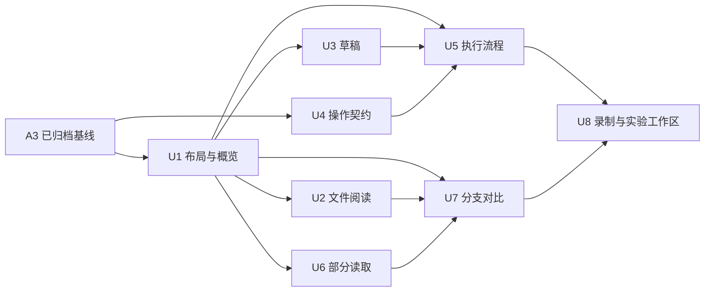

# UI 可用性 change 拆分计划

> 日期：2026-09-21
> 状态（2026-09-29 更新）：U1 [refactor-run-workspace](../../../openspec/changes/archive/2026-09-23-refactor-run-workspace/proposal.md)、U2 [improve-workspace-file-reading](../../../openspec/changes/archive/2026-09-24-improve-workspace-file-reading/proposal.md)、U3 [preserve-debugging-drafts](../../../openspec/changes/archive/2026-09-26-preserve-debugging-drafts/proposal.md)、U4 [add-desktop-operation-tracking](../../../openspec/changes/archive/2026-09-27-add-desktop-operation-tracking/proposal.md)、U5 [unify-run-execution-workflow](../../../openspec/changes/archive/2026-09-29-unify-run-execution-workflow/proposal.md) 均已完成并归档；U6 [add-partial-run-reading](../../../openspec/changes/add-partial-run-reading/proposal.md) 已起草，U7–U8 仍为候选。
> 基线：拆分时 A3-A/B/C 全部归档，U1–U4 均已合入主 spec（`desktop-ui` 现 52 requirements / 236 scenarios，`replay` 8/22、`prompt-replay` 6/15、`model-experiments` 12/38）。依据 [UI 方案 V0.2](2026-09-19-ui-layout-discussion.md)与[实际走查 R1–R11](../../reviews/2026-09-21-ui-usability-walkthrough.md)。
> 文档职责：本文件维护 U 的工程拆分和实施依赖；UI 方案维护界面行为，[可用性规划](2026-09-15-usability-improvement-plan.md)维护 P0–P3 流程，[路线](2026-09-16-isolated-rerun-roadmap.md)维护产品顺序和打包。U1–U8 是 change 编号，不是新的产品阶段。

## 1. 拆分原则

按能独立交付的行为与契约拆为 8 个 change。11 组走查问题是验收来源，不能机械地一条问题开一个 change；也不把组件文件当职责边界。每个 change 交付后现有创建、隔离重跑、文件和实验入口仍须可达，尚未改造的流程按当时已有行为运行。

布局、文件阅读、草稿可以先产生可见改善。操作关联/执行槽是一个完整的跨进程契约，必须包含所有现有主动执行入口及最小 renderer 接线，不能只建一个没人使用的登记表。操作契约与缺父链读取互不依赖，分别收口；缺父链读取包含最小只读降级界面和执行拒绝，不能仅新增 schema 就宣布交付。

本轮暂不估算总工时。正式生成 tasks 时，每条实现任务不超过 2h，并对应具体 scenario；超出就拆任务，不能把整个 IPC 或整个工作区标为 2h。先固定范围，再按实际 design 估算，不用精确小时数代替设计。

## 2. 候选 Change

| 编号 | change 名 | 完成后能做什么 | 硬依赖 | 主要来源 |
|---|---|---|---|---|
| U1 | [`refactor-run-workspace`](../../../openspec/changes/archive/2026-09-23-refactor-run-workspace/proposal.md)（已归档） | 可折叠运行导航、默认概览、完整步骤阅读和每运行阅读恢复 | 已归档基线 | R1/R6/R9，R3 状态色 |
| U2 | [`improve-workspace-file-reading`](../../../openspec/changes/archive/2026-09-24-improve-workspace-file-reading/proposal.md)（已归档） | 在足够宽的工作区看检查点/diff，返回保留文件选择 | U1 | R1/R7 |
| U3 | [`preserve-debugging-drafts`](../../../openspec/changes/archive/2026-09-26-preserve-debugging-drafts/proposal.md)（已归档） | 切步骤、运行、设置或关闭编辑区后保留草稿，明确放弃 | U1 | R2，R3 草稿部分，R10/R11 |
| U4 | [`add-desktop-operation-tracking`](../../../openspec/changes/archive/2026-09-27-add-desktop-operation-tracking/proposal.md)（已归档） | 所有主动执行受 main 登记/去重/执行槽约束，可信关联运行和核对未知状态 | 已归档基线 | R3/R4/R5 的契约基础，V0.1 自审 P2-2 |
| U5 | [`unify-run-execution-workflow`](../../../openspec/changes/archive/2026-09-29-unify-run-execution-workflow/proposal.md)（已归档） | 创建与重跑可跨页查看状态、核实结果、定位失败、返回配置且不丢草稿 | U1 + U3 + U4 | R3/R4/R5/R10/R11 |
| U6 | [`add-partial-run-reading`](../../../openspec/changes/add-partial-run-reading/proposal.md) | 缺祖先文件时可读当前运行的已校验自有记录，仍拒绝不安全执行 | U1 | V0.1 自审 P2-3、V0.2 §18.4 |
| U7 | `improve-branch-comparison` | 定位并打开分支、比较两次修改/输出，四条指标仍可读可辨 | U1 + U2 + U6 | R8/R9 |
| U8 | `unify-recording-and-experiment-workspaces` | 录制接入与已有模型实验使用统一工作区、草稿、操作与结果入口 | U5 + U7 | V0.2 §11/§15.4/§16 的完整设计范围 |

U1/U2/U3/U4/U5 均已归档并有 evidence-index；U6 已起草正式四件套，U7–U8 仍为候选标识。U8 是完整方案的收尾，未把未实测的代理/实验执行问题写成新发现的缺陷。

2026-09-26 补充核对：U1 原归档并非没有缺口，evidence-index 当时为 61/62，且导航折叠后重开入口与调节柄交互未闭合。已先完成 [U1 补齐与实机回归](../../reviews/2026-09-26-u1-completion/README.md)，累计覆盖更新为 62/62，保留原归档历史；100%/200% 导航及 U2 文件状态、U3 草稿恢复通过。当时 U4 尚未实施；09/27 已归档，见页首状态。

## 3. 依赖与实施顺序

默认串行推进 **U1 → U2 → U3 → U4 → U5 → U6 → U7 → U8**。这条顺序先修最直接的正文不可读和草稿丢失，再完成执行闭环。箭头图是硬依赖，默认队列是集成安排；例如 U4 不依赖 U3，U7 不依赖 U5。多个 change 会触及 App/store/DetailPanel，不能据逻辑独立推断可以同时改同一份文件。

普通和隔离运行从 U1 起共同回归，U2 立即使用已交付 C。U5 在父链完整的受支持运行上即可独立验收；U6 交付前缺父链仍明确报详情错误，不提前提供假降级。完整新闭环的“与父运行对比”入口在 U7 才完成，此前保留既有对比能力，不显示未实现的按钮。

## 4. 各 Change 的边界

### U1：运行工作区与概览

目标：打开运行先知道结果，并让步骤/文件各占主工作区。覆盖 V0.2 §3/§4/§7/§9.1–9.2/§9.4，以及 §17/§18 的基础规则。

- 实现：全局栏、可折叠/调整宽度的运行导航、任务/ID 搜索与来源筛选、稳定短 ID 和模型；默认概览、步骤目录和完整调用详情；输出、结束原因、失败跳转、自有消耗及已有缓存口径；按运行恢复页签、调用、展开项和滚动位置。
- 复用：现有 derive、版本校验、Monaco/预算地图和执行门禁；失败/限制/中断语义色同步用于列表及现有树节点。确定图标依赖时在 proposal 显式说明 Lucide 的用途，不同时引入新 UI 框架。
- 过渡：文件页移到主工作区并移除无关步骤目录，具体内部布局和状态归 U2；创建仍可进入现有对话框，设置、实验、重跑入口保持可达；旧分支视图暂保留，导航接线适应新工作区。
- Non-goals：不实现操作登记、跨页执行新承诺、创建工作区、草稿生命周期、文件读取新契约、双运行输出比较或缺父链降级。
- 验收：已有成功/失败/上限/旧记录首次进入概览；错误跳到真实调用；切运行再返回恢复阅读；长 ID/模型不遮挡；1440/1360/1024/800px 及 200% 缩放关键阅读可达。主动执行仍使用既有路径的回归结果不能算作 U5 新流程通过。
- 代码重点：App、RunList、SpanTree、DetailPanel 的阅读部分、store 导航、shared/derive、样式与基础控件。

### U2：文件阅读与状态恢复

目标：解决默认及窄窗口下文件正文不可读、页签往返丢检查点。覆盖 V0.2 §13 和文件部分的 §17/§18。

- 实现：按文件内容容器宽度折叠目录、切换 inline/并排；检查点选择、路径搜索、全部/有变化；首次进入最近自有完成步骤，显式定位优先；保存每运行的检查点/path/列表或内容模式/滚动位置；复制、查找、换行与差异定位工具栏。
- 复用：C 的 inspect/readFile、清单与哈希派生、离线 Monaco。恢复位置重新校验引用，初始不存在、零字节、二进制、缺失、损坏及一侧可读各自呈现。
- Non-goals：不新增文件写入、导出、跨运行文件 diff、祖先步骤选择、源目录补历史或附件修复。
- 验收：R1/R7 路径可复现对照；1210/1024/800px 下短句可正常阅读，不以“有编辑器”代替宽度验收；文件→步骤→文件、切其他运行再返回均恢复；快速切换不串内容；源/父/兄弟/既有附件哈希不变；重启后仍能读记录，阅读偏好不承诺跨进程恢复。
- 代码重点：WorkspaceFileView、lib/workspace-files、U1 工作区接线及 store 文件阅读状态；不重建 IPC 数据层。

### U3：编辑草稿与关闭保护

目标：编辑状态不依赖详情组件是否挂载。覆盖 V0.2 §9.3/§9.5 的草稿、§18.1 与相关键盘规则。

- 实现：按 run/span/field 保存工具结果、system/user prompt、代理 messages 草稿及修订号；创建表单和现有 A/B 臂配置接同一生命周期规则，但保持各自明确的数据结构，不制造通用表单引擎；编辑器就近展开、原值/新值核对、显式放弃。
- 离开：切步骤/运行、关闭编辑、去设置时保留输入；已有创建对话框可关闭后恢复草稿。授权不随草稿恢复，sourceToken 按已有有效期处理，不持久化。未保存设置输入仍由设置流程自行管理，凭据不进入草稿仓库。
- 关闭保护：main 检查 renderer 报告的 dirty 状态，存在草稿时窗口退出确认；renderer 失联不能悄悄当成没有草稿。活跃操作退出保护在 U4 接入，完整提示由 U5 统一。
- 过渡收尾：本 change 不根据 IPC ok 自动清除草稿，提交后保留至明确放弃；U5 才依据核实后的正常终止事件和提交修订号自动清理。失败重跑的结果落点仍待 U5，不把草稿保留写成结果状态问题全部解决。
- Non-goals：不增加磁盘/重启恢复草稿、操作查询、自动重发、执行新权限或统一创建/实验工作区。
- 验收：R2 草稿逐字保留；创建→关闭→配置→新建仍有任务；不同 run 同 span ID 不串草稿；显式放弃可取消；副本授权复位；每种现有编辑入口均验证；保留的模态 Tab/Shift+Tab 不进入背景，关闭后恢复焦点，系统关闭按钮有保护。
- 代码重点：store 草稿与修订关联、各编辑组件、CreateRunDialog、设置返回、main 窗口关闭协商和 shared/preload。模态基础控件在这里补齐，U5/U8 复用。

### U4：主进程操作登记与核对

目标：为现有主动执行提供可信身份、终态和失败记录关联。覆盖 V0.2 §12.3，交付后在现有界面也实际生效。

- 契约：main epoch、operationId、类型/目标、running/settled/notAccepted、可信 runIds 和脱敏诊断；status 与原子 reconcile；同 ID 相同请求仅关联原操作，不同请求拒绝；旧 epoch 拒绝，notAccepted 封禁迟到提交。
- 范围：普通/隔离 create、普通/隔离 result fork、prompt fork、proxy 重发、A/B 真实执行全部接入。A/B 整批一个槽，记录各臂真实 ID；dry-run/目录/文件/预检不占槽，代理被动录制不占槽。
- 门禁：接受执行时原子占槽，执行和收尾结束后释放；settings 保存/清除由 main 同样检查。去重在消耗 sourceToken、授权或产生副作用前生效。释放不依赖列表/详情渲染成功，查询旧操作不能释放另一操作的锁。
- 可信 ID：创建失败 ID 从 run-create 的结构化结果/错误或受控回调取得，不能解析 message；各编排在知道 ID 时登记。proposal 明确需要扩展的内部函数，不以扫描列表猜 ID。暂不要求所有运行在提交瞬间即有 ID。
- 最小接线：preload/shared/store 全入口同时迁移，renderer 握手并附带身份、能查询/恢复登记、按槽禁用提交与配置；保留原页面样式。main 已登记终态和封禁保留到会话结束，UI 关闭不删除。操作仅存 main 内存，不记录请求正文或凭据。
- 关闭：main 有活跃操作时参与窗口退出确认；与 U3 dirty 信号组合为一次确认，若 U3 尚未交付则只覆盖操作。未知上游结局不因退出/新 epoch 被标为已取消。
- Non-goals：不做实时步骤事件、真正取消、跨 main 重启任务恢复、运行队列/多并发、UI 布局重写或 JSONL 格式升级。
- 验收：每类主动入口重复请求零重复调用；同 ID 异参、旧 epoch、reconcile 先到/执行先到、迟到结果、部分 A/B 失败、创建失败已落盘 ID、settings 绕 UI 直接 IPC 均有测试；同 main renderer 重载恢复槽，新 main 旧操作保留未知；原有授权/隔离拒绝继续通过。
- 代码重点：main/ipc 与执行编排、操作登记模块、CreateRunError 等内部关联、shared/preload、store 请求适配；若包层无法暴露可信 ID，先在 design 明确最小扩展，禁止静默改变 replay/trace 格式。

### U5：创建、重跑与执行结果闭环

目标：把 U3/U4 接成用户能连续使用的流程。覆盖 V0.2 §9.6/§10/§12.1–12.2/§12.4/§16。

- 实现：创建工作区、任务优先/高级系统指令、两模式当前模型摘要、目录与本次授权；统一编辑→检查→确认→提交；全局操作入口显示等待时间和可信状态，页面离开仍可读。
- 结果：请求返回、记录定位、运行自有终止事件分层；error/限制/中止/未知保留草稿，正常 completed 仅清理提交对应修订；失败记录直接打开并定位调用，结果不可读只重试读取；用户已离开不改选运行。
- 设置：模型配置表单、就近入口和返回原草稿、保存/清除反馈与确认、密钥单向契约；已有代理设置先保留可达，独立录制工作区归 U8。全局“录制接入”暂定位现有代理区域，不出现空入口。
- 现有 prompt/messages/A/B 执行即使暂用旧编辑区，也必须使用统一操作状态和结果收尾；新实验工作区归 U8。A/B 只有全部预期臂正常结束才可自动清理批次草稿。
- Non-goals：不真实取消、不增加隔离 prompt/A/B、不实现双运行输出页、不扩展工具/配额/权限、不把执行结束呈现为测试通过。
- 验收：受控成功/503/上限/失败记录不可读；R3/R4/R5/R10/R11 完整路径；执行中切运行后通知可定位结果且不抢焦点；恢复草稿后重新预检授权；关闭操作详情不等于停止；现有所有执行类型都有结果收尾回归。
- 代码重点：创建/确认/操作状态视图、各编辑入口、SettingsDialog、store 提交修订与导航意图，消费 U4 而不建立第二套操作真相源。

### U6：缺父链的只读详情

目标：实现 V0.2 §18.4 的 complete/ownOnly 与结构化来源诊断，而不是放宽执行解析。

- 实现：严格读取当前 run，只有确定祖先文件不存在才返回已校验自有数据、连续可得 chain、leafSpanIds、completeness/spanScope/lineage；普通/隔离 result、prompt、proxy、model_params 路径统一标记。
- 展示和门禁：概览/步骤显示缺失原因、自有输出及自有消耗；继承前缀和祖先增量未知；C 文件仍仅按当前合法清单读取。所有主动执行由 main 严格拒绝来源不完整父本，不能仅禁按钮。父文件恢复后全量重验再恢复 complete。
- Non-goals：不修复或改写 trace、不吞 schema/版本/权限/成环/非法 fork 错误、不用源目录补历史、不改 replay 的严格解析语义。
- 验收：各分支类型缺祖先、缺当前 run、祖先损坏、未来版本、v1 非法隔离字段、成环、非法定位、正常链和恢复链；只读不写入；ownOnly 不获得执行权限；原完整轨迹合并保持正确。
- 代码重点：RunRepository、结构化读取诊断、shared/preload、详情完整性消费及 main 执行前置检查。若需 trace-sdk 新增错误类型，仅为区分诊断，不改持久格式；正式 spec 必须列明。

### U7：分支关系与双运行比较

目标：从新旧运行回答改了什么、结果变了什么，并保留四条指标能力。覆盖 V0.2 §14/§15.1–15.3。

- 实现：当前分支定位/搜索、稳定节点尺寸和完整字段、选中/打开/加入对比分离、键盘关系列表；宽幅双运行修改与输出/步骤/消耗视图、交换与返回；四条指标名称列和唯一短 ID 始终可辨。
- 数据：消费 U1 概览派生和 U6 完整性，不再单独推断结局；普通运行区分有共同祖先、不同根、链不完整。文件只分别打开 U2 左右运行的合法检查点，不生成跨运行文件 diff。
- A/B 特例：遵守 `model-experiments` 的比较限制，仅对满足现有条件的模型实验展示各臂事实和相对父 run 的累计增量，不产出臂间差值、胜出臂或最佳模型；不把普通不同根比较规则自动套给 model_params。不可比时允许单独打开记录，不伪装为实验比较成功。
- Non-goals：不扩展实验执行能力、自动质量评分、合并/删除分支、跨运行文件比较或自动对齐无共同前缀步骤。
- 验收：R8/R9、同任务同模型同时间短 ID 碰撞、四列标签宽度、长节点不裁切、点击落点和返回恢复；普通父子/不同根/缺父链分开；prompt/代理仅表达来源；模型实验不可比条件与禁止臂间差值有回归；全程只读。
- 代码重点：BranchTree、ComparePanel、branch-tree/shared 派生、导航与文件跳转。不得把祖先链高亮一律称为共享执行前缀。

### U8：录制与已有实验的工作区整合

目标：让完整 UI 方案里的辅助执行入口也使用已成熟的基础流程，覆盖 V0.2 §11/§15.4 及 §16 的录制分离。

- 录制：独立工作区承载启用意图/真实监听状态、端口/upstream、真实地址复制、会话凭据状态及代理记录筛选；设置内只留跳转。端口占用、配置失败不丢输入，不显示假连接验证。
- 实验：现有 model/params 臂工作区，消费后端 dry-run 的生效/覆盖/丢弃/告警；任何修改使计划失效，执行走 U4/U5，结果按可信 runIds 和 experimentId 分组，任取合法两臂进入 U7；迁移已有代理 messages 编辑入口，保留单请求语义。
- Non-goals：不做官方 Agent 适配、新多臂编排功能、隔离 A/B、真实取消、provider 新能力探测、凭据回读或自动模型排名。
- 验收：代理启停、端口占用、会话凭据缺失和重发；A/B dry-run 零网络零落盘、修改后计划失效、费用确认、部分失败保留草稿和各臂记录；不会因界面分离丢掉原有入口与工具门禁。
- 代码重点：SettingsDialog 的代理部分、录制/实验工作区、现有 A/B/messages 表单，复用已交付草稿/操作/对比。该 change 不重新实现 U4 的编排或 U7 的指标。

## 5. 问题与设计覆盖

| 来源 | 主责 | 共同验收 |
|---|---|---|
| R1 正文被固定列挤掉 | U1 外壳、U2 文件内部 | U2 在实际内容宽度下收口 |
| R2 草稿丢失 | U3 | U5 加核实结果后的自动清理 |
| R3 失败收尾及绿色状态 | U1 状态色、U4 可信关联、U5 结果闭环 | U3 先保证草稿保留，U5 才整项关闭 |
| R4 切页无反馈、完成抢焦点 | U4 契约、U5 呈现 | U5 跨页实测 |
| R5 创建锁屏、失败入口 | U4 失败 ID、U5 创建与反馈 | U5 普通/隔离场景 |
| R6 无概览 | U1 | U5 结果进入概览 |
| R7 文件阅读重置 | U2 | U7 对比往返 |
| R8 对比信息缺失 | U7 | U8 实验入口复用 |
| R9 树与查找问题 | U1 列表搜索、U7 树 | U7 整体回归 |
| R10 模型摘要、设置返回 | U3 草稿、U5 配置/创建 | U8 录制分离 |
| R11 模态焦点越界 | U3 模态基础、U5 创建替换 | U8 复用并回归 |
| 自审 P2-2 Unknown 恢复 | U4 | U5 结果面板 |
| 自审 P2-3 缺父链降级 | U6 | U7 比较完整性 |
| 未列为现状缺陷的 §11/§15.4 完整设计 | U8 | 不据旧截图宣称已验收 |

§17 视觉/键盘/响应式与 §18 加载/错误/状态规则分摊到各 change 的实际界面，不能最后再开一个“统一美化”补遗漏；U8 只负责跨入口最终一致性回归。§19 验收清单在各段生成 scenario 映射，未完成项保持未完成。

## 6. Spec 修改归属与冲突控制

以下是正式写 delta 时的清单，不是本轮已修改 spec。`MODIFIED` 必须携带该 requirement 的完整最终文本和全部保留场景；按每次前置归档后的主 spec 起草，不能让 U5/U7/U8 用今天的旧副本覆盖 U1/U3/U4。

| 现行 capability / requirement | 修改归属 | 要解决的契约差异 |
|---|---|---|
| desktop-ui / 界面提供分支树与轨迹两种视图 | U1 首改，U7 顺序续改 | U1 替换恢复三栏的强制要求，保留共享选择/切换不重扫；U7 完成分支打开与比较导航 |
| desktop-ui / run 列表从 traces 目录扫描派生、run 列表标注录制来源并可过滤 | U1 | 搜索、摘要、短 ID、状态与显式刷新；不写持久汇总缓存 |
| desktop-ui / 详情面板完整展示一步的原始请求与响应、轨迹以 span 树呈现、缓存命中可视化 | U1 | 页面重组仍保留完整原始信息、错误和指标覆盖，不删历史场景 |
| desktop-ui / 文件检查点和差异只读可查 | U2 | 主工作区、内容宽度适配、首次/返回选择和工具栏；保留 C 全部只读/异常/迁移义务，调整强制并排措辞 |
| desktop-ui / tool_result 编辑提供代码级编辑器、调试台提供启动 prompt 的单变量编辑入口、代理 run 的 llm.call 可编辑 messages 重发 | U3 草稿、U4 请求接线、U5 执行收尾顺序修改 | 不改变各执行路径的编辑对象和能力门禁 |
| desktop-ui / 桌面端提供原生 run 创建入口 | U3 草稿补充、U4 请求关联、U5 布局/结果 | U5 替换列表标题区弹窗与无条件自动选中新 run；保留纯对话/v2/空 system/失败落盘等全部 9 个现有场景的语义 |
| desktop-ui / 分叉重跑是唯一的显式写路径、隔离执行边界在操作前可辨认 | U4 请求关联、U5 交互 | 保留权限/轮末语义；将结束后必选中新 run 改为依阅读意图通知或导航 |
| desktop-ui / 运行配置（LLM 接入）经 safeStorage 持久化 | U4 main 配置锁、U5 设置交互 | 真实执行槽校验、就近配置返回、密钥单向与清除确认 |
| desktop-ui / 新增主动执行操作登记和核对 requirement | U4 | 定义 epoch/ID/去重/执行槽/status/reconcile/失败 ID/退出保护；不另建重复操作 capability |
| desktop-ui / 分支 run 展示解析后的完整轨迹、prompt fork 详情呈现独立新轨迹与父级溯源、proxy fork 的分支视图降级为父链列表 | U6 | 新增严格 ownOnly 例外与来源完整性，不将非文件缺失吞为降级 |
| desktop-ui / 渲染进程无文件权限且跨进程数据经校验、隔离详情 IPC 保留数据并校验版本 | U4/U6 各自增量核对 | 新展示元数据经过 schema；不回退 v1/v2 守卫，“ownOnly”也是完整校验的有效结果 |
| branch-tree / 分支森林从 run 的 parent 关系纯派生 | U6 校准降级边界，U7 续改展示 | 区分列表构图容错与详情严格读取，不把父损坏/成环等当不存在；缺父占位不伪造记录 |
| branch-tree / 分支树以节点-边图呈现运行与分叉 | U1 最小状态展示 delta，U7 顺序续改 | U1 保留底层 completed/crashed，补按终止原因展示节点文字/颜色；U7 再修点击/打开与来源祖先链语义，不对 prompt/proxy 一律声称共享前缀 |
| branch-tree / 布局确定且节点不重叠、数字口径区分本 run 增量与全链累计 | U7 | 修正节点尺寸与比较展示，保留自有/累计口径 |
| desktop-ui / 新增双运行结果比较 requirement | U7 | 输出/修改/步骤/自有指标与部分数据规则，文件仅分别打开 |
| model-experiments / 比较沿用共同祖先和现有派生口径 | U7 核对并明确共用比较 UI 的限制，U8 消费 | 保留模型实验不可比条件及禁止臂间差值/胜出结论，不因通用比较而放宽 |
| desktop-ui / 代理设置与运行状态可观测可控；model-experiments / 成本确认和 dry-run 必须显式、同一批实验必须可分组 | U8 | 页面分离、计划失效、可信结果跳转；原模型/工具/参数语义保持 |

U1 的新概览/导航、U3 的会话草稿、U5 的统一结果流程应各有明确 ADDED requirement；不把这些新义务塞进无关 requirement 的附注。trace-format/workspace-isolation/replay/prompt-replay 默认无格式或执行能力 delta；若 U4/U6 实施前设计发现确需包契约扩展，在对应 proposal 明列影响并修改受影响 spec，不能以 UI 改造名义静默扩大。

## 7. 验收与交付节点

每个 change 都须有独立场景证据、适用的单元/IPC 集成测试、实际桌面操作、质量检查和桌面构建。文档校验通过不是运行验收；200% 缩放、原生目录选择和失败路径缺证据时如实列未验证，不勾完任务。各段使用 U1 建立的同一组真实/受控 fixture，包含普通、隔离、多工具轮末、重复分叉、prompt、代理、模型实验和坏数据。

| 节点 | 条件 | 可以说明的完成范围 |
|---|---|---|
| 阅读可用 | U1 + U2 验收 | 概览、步骤和文件阅读布局完成；执行/草稿问题仍未全部完成 |
| 执行可用 | U3 + U4 + U5 连同 U1/U2 验收 | 普通和隔离创建/重跑的草稿、状态与结果流程完成；仍沿用旧对比时不称完整新 UI 闭环 |
| 主要调试闭环 | U1–U7 全部验收 | 缺父链阅读、打开→修改→重跑→结果→双运行比较连通 |
| 完整 V0.2 范围 | U1–U8 全部验收，并完成跨入口回归 | 录制和已有模型实验也使用统一体验；P3 外部试用是否完成另记 |

以上不是新发版编号。阅读或执行节点后可按路线 §9.1 的条件安排 K1 体验包；A3 完成并不自动证明 K3 实包已验收，也不要求为每个 U change 打一次包。最终便携包须独立验证源码/版本、构建、体积、资源、首次启动、历史数据副本、重启与设置持久化，记录实际包含的 U 编号。

## 8. 后置范围

真正取消与实时步骤事件、跨 main 重启任务恢复、跨运行文件 diff、导出（R2.1）、隔离 prompt/模型实验、Shell/真实测试（R3）、自动排名及项目管理均不进入这 8 个 change。可以保留未来入口位置，但不得显示可点击的假功能。现有操作 status/reconcile 是 U4 的必要范围，不能再次归到后置取消/实时进度。

## 9. 下一步落地

**U1 `refactor-run-workspace`、U2 `improve-workspace-file-reading`** 均已完成并归档，规范已合入主 spec。实施和验收分别见 [U1 evidence-index](../../../openspec/changes/archive/2026-09-23-refactor-run-workspace/evidence-index.md) 与 [U2 evidence-index](../../../openspec/changes/archive/2026-09-24-improve-workspace-file-reading/evidence-index.md)。

**U3 `preserve-debugging-drafts`** 已完成实施与实机验收，**2026-09-26 已归档**（`archive/2026-09-26-preserve-debugging-drafts/`），9 条 requirement / 41 条场景已合入主 spec `desktop-ui`（38→47 requirements、159→200 scenarios，既有场景零丢失）。tasks **37/37**，验收与证据见 [U3 evidence-index](../../../openspec/changes/archive/2026-09-26-preserve-debugging-drafts/evidence-index.md)。

**U4 `add-desktop-operation-tracking`** 已完成实施与实机验收，**2026-09-27 已归档**（`archive/2026-09-27-add-desktop-operation-tracking/`）。tasks **48/48**，验收与证据见 [U4 evidence-index](../../../openspec/changes/archive/2026-09-27-add-desktop-operation-tracking/evidence-index.md)（12 requirement / 63 场景逐条机器回查）。四条 delta 已合入主 spec：`desktop-ui` 47→52 requirements / 200→236 scenarios（5 ADDED + 4 MODIFIED 整段替换，既有场景零丢失），`replay` 7→8、`prompt-replay` 5→6、`model-experiments` 11→12 各 +1 requirement。归档后差集复核脚本 `.workbuddy/u4/u4-7-archive/post-archive-diff.cjs`（基线取归档前的主 spec，两道反证咬住）。

下一主线为 **U6 `add-partial-run-reading`**：按本计划 §4 的范围实施四件套，消费 U1 的详情/阅读基线并保留 U4/U5 的执行门禁；U6 的 proposal/design/tasks/spec delta 已在 `openspec/changes/add-partial-run-reading/`，文档校验不算功能验收。

U7–U8 先按本计划保留候选，前置契约稳定后逐个展开正式四件套。U6 已固定“祖先不存在”诊断来源、部分读取边界和执行拒绝契约；tasks 仍须在实施中用 fixture、单测、Electron 场景和 evidence-index 逐项验收。每次生成正式 change 时回填本表状态和链接，再按依赖实施、验收和归档。
